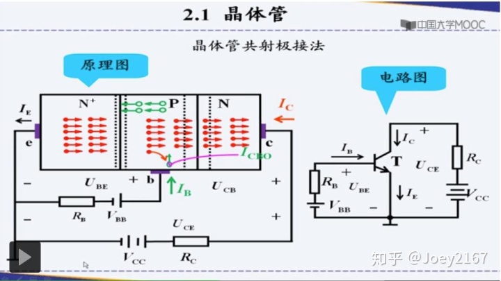

作者：李泽光
链接：https://www.zhihu.com/question/36475338/answer/81229987
来源：知乎
著作权归作者所有。商业转载请联系作者获得授权，非商业转载请注明出处。

我还是那个观点，一定要站在发明者的角度来看问题，只有这样，一切问题才都能迎刃而解。因为模电的内容就是发明---使用---发现问题---改进---再发明—再使用的过程，是我们学习前人发明和使用的东西。

我们就以二极管和三极管为例，二极管是控制导线中电子的流动方向，而三极管是控制导线中流动电子的多少。这也是“电子技术”的根本。理论搞明白了实验就简单了。

**下面主要是以三极管为例来说明导线中电流的控制**。

我们都非常熟悉**家用手电筒电路，手电筒电路中有“三要素”，即电源VCC、灯泡L（或者说负载Rc）、 开关K，如下图所示。**

现在，我们**不想用手动方式**去实现开关K的合上以及断开，我们想用一个信号去控制一个器件来实现电路的“**通和断**”。

要想控制一根导线中的电流，首先要把这根导线断开，断开的两端我们分别叫做C端和E端（C和E实际上是输出回路的两端）。

如果我们在C和E之间加个器件，这个器件如果能使电流从C端流进并能从E端流出来（**因为C和E本来就是我断开的一个回路的两端**），同时这个电流又能被我们加的信号所控制住，那么这个器件就成功了。（一定要注意，我们要实现什么目标，我们要控制一个电回路的通和断）

为了实现上述要求，接下来我们就在C-E之间放一个NPN（或PNP）结构的半导体，可是，现在的问题是，在这种情况下无论怎样在C和E之间加电源 （不击穿情况下）  ，C-E这根导线始终都不会有电流（其实这种情况下，C-E之间是有穿透电流的（它是由少子引起的），因其非常小，这里忽略不计，这也是半导体材料存在的缺点。实际上，我们不希望它存在）。

我们又知道，电子流动的方向与人们定义电流的方向相反（这是因为当时人们以为电线里流过的是电流），所以，我们将中间半导体引出一个电极（B极）。

在B-E之间（实际上是加在发射结上，见PN结特性）加一个正向电压，这时发射区就会向基区发射电子从而形成E极流出的电流**Ie**，但是，要想实现这个电流是从C端入、从E端出，则必须要把发射区发射的这些电子都收集到C极去，这样我们需要在C和E之间加正向电压，使集电结处于反向击穿状态，使电子能顺利收集到C极，这个收集电子的能力要比发射电子的能力强，它就像一个大口袋，你发射区发射多少我就收多少（这样就能理解三极管输出特性曲线了，当B极电流一定时，随着CE电压的增加，C极电流就不再增加了，因为B极电流一定时，发射区发射的电子数量就一定了，你收集的能力再强也要不到多余的电子了），这样，这个器件就成了，可以实现电流从C端到E端（因为当初我假设它们之间是被我断开的导线两端），最理想的是流进C端的电流就等于E端流出的电流，同时这个电流又被一个BE电压（或信号）控制，但是，三极管不是一个理想的器件，因为C端电流不等于E端电流，有一部分电流流过B极，我们尽量使C端电流等于E端电流，所以，这就是为什么在工艺上要使基区浓度要低而且还要薄，同时集电结的面积还要大的根本原因。

**谈一谈Ic受Ib控制的问题：**

通过前面的叙述，我们已经知道发射极电流Ie受发射结电压控制，由于我们采取了工艺上的措施，使得集电极电流Ic近似等于发射极电流Ie，这样就可以说集电极电流Ic受发射结电压控制。我们又从三极管**输入特性曲线**可知，当Vbe和Ib的关系处于特性曲线的近似直线的位置时，基极电流Ib与发射结电压就成线性关系，这样，可以说集电极电流Ic与基极电流Ib就成比例关系。往往我们会站在不同角度来看问题，我们从**电流放大的角度来看时**，刚才说过集电极电流Ic比基极电流Ib大很多，同时它们又成比例关系，因此，在进行计算的时候就说成是集电极电流Ic受基极电流Ib控制。这其实是人们站的角度不同而已（从电流放大的角度来看的），其实，集电极电流Ic还是由发射结电压控制的，等到了高频小信号模型的时候，就会说集电极电流受发射结电压控制了。

**Uce电压的作用**是收集电子的，它的大小不能决定Ic的大小，从三极管输出特性曲线可以看到，当Ib一定时（也就是Ube一定时），即使Uce增加，Ic就不变了，但是，由于半导体中有少子存在，使得输出特性曲线随着Uce增加而有些上翘，其实这是半导体材料存在的问题。实际上，Ie是受从输入端看进去的发射结电压控制的（可以参见三极管高频小信号模型），加Uce电压的时候发射结已经处于导通了，它的影响不在发射结而在集电结，加Uce电压是为了让Ic基本等于Ie，所以说Ic受发射结电压控制，人们为了计算方便把这种控制折算成受Ib控制，就是因为说成这样，使得人们不太容易理解三极管工作的原理。从输出回路受输入回路信号控制的角度来看，Ic不是由Ie控制的，但是，Ic其实是由Ie带来的，所以，也可以说Ic受Ie影响的，这也得受三极管制造工艺影响，如果拿两个背靠背二极管的话，怎么也不行。

**尽管三极管不是一个理想器件**，但是，它的发明已经是具有划时代意义了。由于它的B极还有少量电流，因为这个电流的存在意味着输入回路有耗能，如果我不耗能就能控制住你输出回路的电流，那这个便宜就大了，所以，后来人们发明了场效应管。其实，发明场效应管的思想也是与三极管一样的，就是为了用一个电压来控制导线中的电流，只是这回输入回路几乎不耗能了，同时，器件两端的电流相等了。

**从使用者的角度（非设计者）来看看三极管的应用：** 

**三极管的两个基本应用分别是“可控开关”和“信号的线性放大”**。

**可控开关**：C和E之间相当于一个可控开关（当然。这个开关有一定的参数要求），当B-E之间没有加电压时，C-E之间截止（C-E之间断开）；而当B-E之间电压加的很大，发射区发射的电子数量就多，C极和E极的电流就很大，如果输出回路中有负载时（注意，输出回路没有负载CE之间就不会饱和），由于输出回路的电源电压绝大部分都加到负载上了，CE之间的电压就会很小，CE之间就处于饱和状态，CE之间相当于短路。在饱和情况下，尽管C极电流比基极电流大，但是，C极电流与输入回路的电流（基极电流）不成β的比例关系。

以最简单的电路为例，我们家里都有手电筒，手电筒有三个要素（具有普遍意义）：电源、灯泡（负载）和开关，这里的开关需要直接手动进行合上与断开，用三极管代替这个开关我们就能实现用信号来控制，计算机在远端就能控制这个回路。控制高压、大电流的还请大家看看IGBT等功率芯片及模块，那是真震撼。 

**从另一方面看饱和：**从输出特性曲线可以看到，IB一定时VCE电压不用很大，那个输出特性曲线就弯曲变平了，这说明收集电子的电压VCE不用很大就行，其实不到1V就行，但是，实际上我们在输出回路都是加一个电压很大的电源，你再加大VCE也没有用，我们看到，IB一定时VCE增加后对IC的大小没有影响（理想情况），所以要想把发射的电子收集过去，VCE根本不用很大电压。

但是，通常情况下，我们会在输出回路加入一个负载，当负载两端电压小于电源电压时，电源电压的其它部分就加在CE两端，此时三极管处于线性放大状态。但是，负载两端电压的理论值大于电源电压时，则三极管就处于饱和状态，这种情况IC不用很大也行。

所以不要以为VCE一定很大三极管集电极才能收集到电子，可以看到收集电子的电压很小就行。对于饱和的问题来说，除了上一段文字中说到的电流很大引起饱和外，我们还可以从电压的角度来看，假设三极管β=50\beta =50\beta =50，电源电压为12V，基极电流为40微安，则集电极电流就是2毫安，如果集电极接一个3KΩ\Omega \Omega 电阻，则VCE=6V，而这个电阻换成30KΩ\Omega \Omega 时，VCE趋于零了，这种情况下三极管也是饱和了，所以从电压角度来看，集电极电流不一定很大，在选择合适负载电阻的情况下，三极管也可以处于饱和状态，所以，饱和与负载有关，如果电源电压很大，那饱和时VCE就这么一点点电压而言那当然是微不足道的，所以，很多地方就将它约等于零了，但是并不能说它没有电子收集能力。

**信号的线性放大**：这种情况下，C极电流与B极电流成线性比例关系IC=βIB（BE之间电压要大于死区电压，同时，VCE不趋于零），而且，C极电流比B极电流大很多，前面已经知道，C极电流的大小受BE电压控制（人们为了分析问题方便，将这种控制关系说成是C极电流受B极电流控制）。实际上，马路上到处跑的汽车就是一个放大器，它是把驾驶员操作信号给放大了，它也是线性放大，是能量的放大，而多余的能量来自于燃烧的汽油。

模电这门课从三极管小信号模型开始的绝大多数内容都是讲小信号放大问题，共射极、共集电极、共基极的4个电路是基本，其它的是由他们组合而成的，它们的电路组成、电路交直流分析、电路性能分析是关键。

其它的就是功率放大的问题、模拟集成运算放大器内部结构设计问题、运放的应用、如何减少非线性失真和放大稳定问题（负反馈）、正弦波产生（正反馈）等等。

模电从细节和总体上把握。

**模电的学习：**

从使用者的角度来看，其实，模电这门课并不难，学生往往被书中提到的所谓少子、多子、飘移、扩散等次要问题所迷惑，没有抓住主要问题，有些问题是半导体材料本身存在缺陷导致的，人们为了克服这些缺陷而想出了各种解决办法，所以，模电中有许多是人们想出的技巧和主意。从三极管三个电极连接的都是金属的角度来看，金属中只有自由电子的定向流动才有电流，金属中哪有什么空穴之类的东西，如果把人们的视线停留在三极管的内部，那一定使人们不容易理解，如果你跳出来看问题，你就会理解科学家当时为什么要发明它，也会使你豁然开朗。但是，从设计者角度来看，需要考虑的问题就很多了，否则，你设计出来的器件性能就没有人家设计的好，当然也就没有市场了。如果谁能找到一种材料，而这种材料的性能比半导体特性还好，那么他一定会被全世界所敬仰。所以，学习模电的时候，一定要用工程思维来考虑问题，比如，为什么要发明它？它有什么用途？它可以解决什么问题？它有哪些不足？人们是如何改进的？等等。

**再谈可控开关：**

三极管要工作在饱和或截止状态，此时C和E之间相当于可控开关，B极加输入信号，为了防止三极管损坏，B极要接限流电阻，余下的问题就是，所控制的负载应接在C极还是E极？它的功率有多大？驱动电压多大？电流多大？你选的三极管能否胜任？不胜任怎么办？改用什么器件？低压和高压如何隔离？等等。

**再谈信号的线性放大：**

这种情况下，C极电流是B极电流的β倍，以三极管放大电路为例：

（1）**直流工作点问题**，为什么要有直流工作点？什么原因引起工作点不稳定？采取什么措施稳定直流工作点？

为什么要有直流工作点？是因为PN结只有外加0.5V以上电压时才有电流通过（硅材料），而我们要放大的微弱的交变信号幅度很小，将这个微弱的变化信号直接加到三极管的基极和射极之间，基极是没有电流的，当然，集电极也不可能有电流。所以，我们在基极首先要加上直流工作电流后，三极管三个电极就都有直流电流了， 以NPN管子为例，共射、共基、共集电极三个电路的直流都是一个方向，无论三极管电路的哪种接法，它们的直流电流方向都是一样的，在这基础上，再在输入端（发射结）加入微弱交流小信号后，这个微弱信号就会使基极电流产生扰动，由于集电极电流与基极电流成比例关系，则集电极电流（输出回路电流）也会发生扰动，这样，这个输出回路电流中就有被输入交流信号影响的扰动信号，我们要的就是输出回路这个被基极扰动电流控制的集电极扰动的信号（输出交流信号），**这个输出回路（集电极-发射极）扰动的信号比输入（基极）扰动信号大，这就是放大，也可以说，放大其实是输出回路电流受输入信号的控制**。但是，不管怎样扰动，总体上是不能改变三个电极电流的方向的。

如果直流工作点设置合理时，那个扰动信号就与输入交流小信号成比例关系，而且又比输入信号大，我们要的就是这个效果。

（2）**交流信号放大问题**，共射极、共集电极、共基极电路的作用、优点和缺点是什么？如何克服电路的非线性？为什么共射--共基电路能扩展频带？为什么共集电极放大电路要放在多级放大电路的最后一级？多级放大电路的输入级有什么要求？人们在集成电路中设计电流源的目的是什么？它的作用是什么？如何克服直接耦合带来的零点漂移？为什么要设计成深负反馈？其优点和问题是什么？深负反馈自激的原因是什么？什么是电路的结构性相移？什么是电路的附加相移？什么情况下电路输出信号与输入信号之间出现附加相移？等等。

**（3）集成运算放大器**，为了克服半导体器件的非线性问题（不同幅度信号的放大倍数不一样），人们有意制成了高增益的集成运算放大器，外接两个电阻就构成了同相或反向比例放大电路，这时整个电路的电压放大倍数就近似与半导体特性无关了（深负反馈条件下），放大倍数只与外接的两个电阻有关，而电阻材料的温度特性比半导体材料好，同时线性特性也改善了。在计算的时候注意运用“虚短”和“虚断”就行了，模电学到这里那就太简单了，所以，如果不考虑成本时谁还会用三极管分立元件组成的放大电路，还得调直流工作点。集成运算放大器的其它应用还很多，如有源滤波器、信号产生电路等。

**负反馈自激振荡与正弦波产生电路的区别**

负反馈自激振荡是由于某个未知频率信号在反馈环路中产生了额外的180度的附加相移，负反馈电路对这个频率信号来讲就变成了正反馈，同时，对这个频率信号的环路增益又大于1，这种情况下，负反馈电路就自激了（对其它频率信号，此电路还是负反馈）。而正弦波振荡电路是人们有意引入的正反馈，可以说对无数个频率信号都是正反馈，既然这样，环路中就不用有附加相移了，但是，这样的信号太多了，所以，人们需要在反馈环路中设计一个选频电路来选择某一个频率信号，当然，对被选取的信号来讲，这个选频电路就不需要有额外相移了。

以上大致总结了一些问题，仅供参考。

为了从全局了解这门课，以及更容易学好这门课，建议参见我主页上我写的文章“模拟电子技术基础课程新的目录”，希望对大家有帮助。

# BJT工作原理

在三极管器件的设计中，通常会在发射区进行N型高掺杂，以便在发射结正偏时从**发射区注入基区的电子在基区形成相当高的电子浓度梯度**。基区设计的**很薄**，这样注入到基区的电子只有很少一部分与多子空穴复合形成基极电流。与基区电子复合的源源不断的空穴需要基极提供电流来维持。在设计中对集电区则进行较低的P型掺杂且面积很大，以便基区高浓度的电子扩散进去集电区形成集电极电流。
**（电流与空穴方向一致）**

1.本章主要介绍bipolar三极晶体管的知识

2.本章主要内容如下：

- 晶体管的结构
- 工作原理
- [伏安特性](https://www.zhihu.com/search?q=伏安特性&search_source=Entity&hybrid_search_source=Entity&hybrid_search_extra={"sourceType"%3A"article"%2C"sourceId"%3A"71716927"})及主要电参数
- 共发射极、共集电极、共基极三种放大电路的组成
- 电路的静态（无输入电信号的状态）和动态（有输入电信号的状态）分析方法
- 温度对晶体管参数及放大电路静态工作点的影响
- 多级放大电路的分析方法
- 放大电路的频率特性分析方法

3.晶体管

- 是通过一定的半导体工艺，将两个PN结结合在一起的器件，两个PN结相互影响，使晶体管表现出不同于单个PN结，而具有放大的作用，晶体管就是利用其放大作用组成放大电路
- 晶体管的类型根据结构类型可分为：NPN型和PNP型
- 三个极的命名：B取自英文base，基本的；C取自collector，收集；E取自emitter，发射
- 根据材料不同可分为：硅管和锗管
- 三极管最基本的作用是放大作用，它可以把微弱的电信号变成一定强度的信号，当然这种转换仍然遵循能量守恒，它只是把电源的能量转换成信号的能量。三极管有一个重要参数就是电流放大系数β。当三极管的基极上加一个微小的电流时，在集电极上可以得到一个是注入电流β倍的电流，即集电极电流。集电极电流随[基极](https://baike.baidu.com/item/基极)电流的变化而变化，并且[基极电流](https://www.zhihu.com/search?q=基极电流&search_source=Entity&hybrid_search_source=Entity&hybrid_search_extra={"sourceType"%3A"article"%2C"sourceId"%3A"71716927"})很小的变化可以引起集电极电流很大的变化，这就是三极管的放大作用。
- 把两个PN结背靠背的放在一起，不会有放大的作用，但是晶体管具有放大的作用，主要是晶体管具有非常独特的内部结构
- [NPN型晶体管](https://www.zhihu.com/search?q=NPN型晶体管&search_source=Entity&hybrid_search_source=Entity&hybrid_search_extra={"sourceType"%3A"article"%2C"sourceId"%3A"71716927"})的示意图：

发射结的导通正方向为从基区到发射区；[集电结](https://www.zhihu.com/search?q=集电结&search_source=Entity&hybrid_search_source=Entity&hybrid_search_extra={"sourceType"%3A"article"%2C"sourceId"%3A"71716927"})的导通正方向为从基区到集电区；两个PN的正向导通的方向相反

NPN型晶体管的符号：

有箭头的是发射极，一般NPN型晶体管的基极接高电位，所以习惯画法箭头由基极指向[发射极](https://www.zhihu.com/search?q=发射极&search_source=Entity&hybrid_search_source=Entity&hybrid_search_extra={"sourceType"%3A"article"%2C"sourceId"%3A"71716927"})

- PNP型晶体管结构示意图：

PNP型晶体管的电路符号：

有箭头的是发射极，一般PNP型晶体管的发射极接高电位，所以习惯画法箭头由发射极指向基极

- 平面型晶体管的结构示意图

a.发射区小，掺杂浓度高；

b.集电区面积很大；

c.基区掺杂浓度很低，而且很薄；

- 晶体管的工作原理

依据晶体管中两个PN结的偏置情况，晶体管工作在四中状态：**放大状态、饱和状态、截止状态、倒置状态**

（1）**放大状态条件：发射结正向偏置，集电结反向偏置**

a.VEE使发射结正向偏置，VCC使集电结反向偏置

b.[载流子](https://www.zhihu.com/search?q=载流子&search_source=Entity&hybrid_search_source=Entity&hybrid_search_extra={"sourceType"%3A"article"%2C"sourceId"%3A"71716927"})的传输规律

**发射结PN结正向偏置，有利于多数载流子的扩散运动，不利于少数载流子的漂移运动 →**

**因此，发射区就会向基区扩散多数载流子（自由电子），从而形成电子电流→**

**同理，基区的多数载流子也会向发射区扩散从而形成空穴电流→**

**因此，发射结的电流应该由两部分形成，一部分是发射区的多数载流子自由电子向基区扩散形成的电子电流，另一部分是基区的多数载流子空穴向发射区扩散形成的空穴电流→**

**但是，由于基区的掺杂浓度很小，空穴电流可以忽略不计→**

**发射区扩散到基区中的自由电子会和基区的空穴附和，从而形成基极电流→**

**由于空穴的掺杂浓度很低，因此，基极电流很小→**

**剩余的大多数自由电子继续向集电结扩散→**

**由于集电结反向偏置，PN结反向偏置时，有利于少子的漂移运动，不利于多子的扩散运动→**

**由于剩余的自由电子属于少数载流子，很容易穿过集电结到达集电区，从而形成集电极电流**

在晶体管中，除了自由电子在扩散过程中形成的电流外，还存在集电区和基区中的少数载流子相互漂移运动形成的饱和电流。集电区中的少数载流子是空穴，会在电场的作用下向基区扩散。基区中的少数载流子自由电子也会在电场的作用下向集电区做漂移运动。由此形成一个反向饱和电流$I_{CBO}$，这个电流受温度影响比较大，会影响晶体管的稳定工作。

# 电导调制效应

1. 增加的多子来自于外部的正向电流。
2. 正向电流增大，PN结多子浓度增大，电导率增大，电阻率减小
3. 电中性条件是一个动态平衡，PN结中的载流子会流出，而外部电路的载流子也会流入，所以我们要分析它整体的载流子浓度

画一个简单的示意图：

电导调制效应是[Webster效应](https://baike.baidu.com/item/Webster效应)，是在大注入时基区电导增大的现象；而基区宽度调制效应就是Early效应，是集电结电压变化而致使基区宽度变化、并造成伏安输出特性倾斜、使输出电阻减小的现象；另外，基区宽度展宽效应就是Kirk效应，是在大电流下基区宽度增大的现象。这三种重要的效应是BJT的一种基本特性，要注意区分开来！

当PN结上流过的正向电流较大时，注入并积累在低掺杂N区的少子空穴浓度将很大，为了维持半导体中性条件，其多子浓度也相应大幅度增加，使得其电阻率明显下降，也就是电导率大大增加，这就是电导调制效应。

更准确的定义下： Webster效应也称为**基区电导调制效应**，这是BJT在大工作电流时、基区电导发生增大的一种现象。

因为半导体内部各点总是要保持电中性，所以，在发射结正偏、向基区注入少子的同时，也必将有相同数量、相同浓度梯度的多子在基区中积累起来；当注入的少子浓度很大（**大注入**）、接近掺杂浓度时，则额外积累起来的多子浓度也就与掺杂浓度相当了，这时，基区的电导率实际上就决定于基区掺杂浓度和额外增加的多子浓度的总和（换句话说，大注入的结果就相当于增加了基区掺杂浓度），从而基区的有效电导率大大增加了（注入越大，有效电阻率降低得越多），这就是基区电导调制效应（也称为Webster效应）。

[Webster效应](https://baike.baidu.com/item/Webster效应/9932904)的直接影响就是BJT基区的电阻率下降（电导率增大），使得发射结的**注射效率**降低，减小了**电流放大系数**。

对于基区掺杂浓度分布均匀的晶体管（例如**合金晶体管**）而言，引起其在大电流下电流放大系数b下降的主要原因就是Webster效应。不过，对于Si[平面晶体管](https://baike.baidu.com/item/平面晶体管/8918982)，由于基区掺杂浓度较高一些，所以Webster效应的影响往往较小（这时，引起大电流时b下降的主要原因是**Kirk效应**）。

总之，BJT在**大电流**（**大注入**）工作时，往往容易出现**发射极电流集边效应**、**Kirk效应**和**Webster效应**。虽然这些现象，对于BJT工作而言都属于二级效应，但是在设计较大功率的器件（特别是高频大功率晶体管）时，却是必须要考虑和解决的一些重要问题。