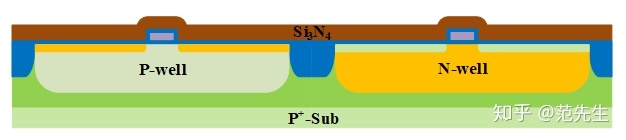
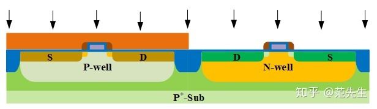
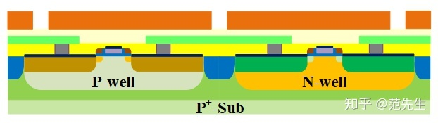

作者：超级奶爸
链接：https://zhuanlan.zhihu.com/p/339876176
来源：知乎
著作权归作者所有。商业转载请联系作者获得授权，非商业转载请注明出处。

**2.1 0.18 μm CMOS前段工序**

**2.1.1. 有源区的形成**

​       首先，在P型衬底 (P-Substrate) /P型外延 (P-Epitaxial) 层热氧化生长一层SiO2，称为衬垫氧化层 (Pad Oxide)，其作用是缓解随后生长Si3N4与硅衬底之间的应力。因为Si3N4与硅的晶格常数不匹配，两者之间存在较大的应力，若Si3N4与硅直接接触，易导致硅衬底碎裂。随后沉积Si3N4，旋涂光刻胶 (Photoresist，PR)，使用Mask光刻，去除器件隔离区的PR。接着酸刻蚀，依次去除Si3N4、SiO2和Si，形成硅的浅槽，如图2.1.1。

图2.1.1

​       去除PR后，在1000℃下热生长SiO2 (Rounding Oxide)，此步骤可以使浅沟槽底部尖角变得圆滑，避免击穿电压降低和改善漏电流。随后低压气相沉积SiO2，在950℃、O2和N2氛围下进行致密化处理，如图2.1.2。

图2.1.2

​       采用化学机械抛光 (Chemical Mechanical Planarization，CMP)，抛除表面的SiO2至到Si3N4为止，再用热磷酸 (H3PO4) 刻蚀掉Si3N4，最后去除有源区表面的SiO2，如图2.1.3。

图2.1.3

**2.1.2. N、P-well的形成**

​       接着就是N、P-well的制作。旋涂PR后Mask光刻去除N-well区域的PR，进行离子注入，如图2.1.4。将高能、大剂量 (约为1013量级) 的杂质磷 (P) 注入，形成N-well，将低能 (约为1012量级) 砷 (As) 注入，防止PMOS源、漏极之间的穿通 (Punch Through)。最后注入低能As约为1011量级，调节PMOS的开启电压。

图2.1.4

​       旋涂PR后Mask光刻去除P-well区域的PR，P-well离子注入，如图2.1.5。首先高能、大剂量 (约为1013量级) 的杂质硼 (B) 注入，形成P-well，将低能 (约为1012量级) B注入，防止NMOS源、漏极之间的穿通。最后注入低能B约为1011量级，调节NMOS的开启电压。P、N阱分三次注入，能量和剂量由高至低，浓度分布自硅片表面往下从低到高，这种阱称为倒置阱 (Retrograde well)。

图2.1.5

**2.1.3. 牺牲氧化层生长及去除**

​       生长约25 nm的氧化层 (称为牺牲氧化层，Sacrificial Oxide)，用来捕获因离子注入等环节导致的有源区硅表面产生的缺陷，如图2.1.6。

图2.1.6

​       采用HF溶液刻蚀牺牲氧化层，如图2.1.7。

图2.1.7

**2.1.4. 栅氧化层及栅的形成**

​       在800℃下热生长2~10 nm的栅氧化层，这是工艺中最为关键的一步，厚度要求精确到Å量级，再沉积多晶硅作为栅极，如图2.1.8。

图2.1.8

​       多晶硅沉积完成后进行栅极光刻。旋涂PR，Mask光刻后采用干法刻蚀，形成器件的栅极和多晶硅互连，如图2.1.9。

图2.1.9

​       去除光刻胶，在多晶硅表面生长薄氧化层，用于缓冲隔离多晶硅和后续Si3N4的形成，图2.1.10。

图2.1.10

**2.1.5. 轻掺杂源、漏 (LDD)**

​       Mask对NMOS源、漏的轻掺杂 (Lightly Doped Drain, LDD) 区进行光刻处理，随后离子注入形成NMOS轻掺杂的源漏区域 (NLDD)，如图2.1.11，注入元素为As，剂量为1013量级，注入能量较低，位置较浅。

图2.1.11

​       PMOS轻掺杂 (P LDD) 光刻及离子注入，注入B元素，剂量1013量级，如图2.1.12。由于B的扩散比As快，因此PLDD的注入能量要比NLDD的注入能量低。

图2.1.12

**2.1.6. Spacer**

​       通过CVD方法沉积Si3N4，厚度120~180nm，如图2.1.13。

图2.1.13

​       通过反应离子刻 (Reactive Ion Etching, RIE) 对水平表面的薄层Si3N4刻蚀，留下隔离侧墙 (Spacer)，如图2.1.14。接着对注入后的LDD进行快速热退火 (Rapid Thermal Annealing, RTA)。Spacer作为后续S、D区注入的阻挡层，这一工艺称为自对准工艺。

图2.1.14

**2.1.7. CMOS的源、漏制作**

​       旋涂PR，采用Mask光刻出NMOS区域，如图2.1.15。注入As元素，剂量约为1015量级，注入能量约为60KeV，形成NOMS的源 (Source，S)、漏 (Drain，D) 区域。

图2.1.15

​       旋涂PR，采用Mask光刻出PMOS区域，如图2.1.16。注入BF2+，剂量约为1015量级，能量比NMOS低, 形成PMOS的S、D。

图2.1.17

​       NMOS、PMOS的S、D注入好后进行RTA，激活注入元素和消除注入损伤，如图2.1.18。

图2.1.18

​       除去表面氧化物，在氢氟酸溶液中快速浸泡，使栅、源、漏区的硅暴露出来，如图2.1.19。

图2.1.19

**2.1.8. 金属硅化物的形成**

​       为减小多晶硅的电阻、金属与多晶硅之间的接触电阻，CMOS工艺一般采用金属硅化物 (Salicide)。金属多采用金属钛 (Ti) 或 (Co)，在硅片上溅射的方式沉积一层厚度20~40 nm的Ti，如图2.1.20。

图2.1.20

​       随后进行RTA，高温下金属和硅反应形成金属硅化物，如图2.1.21。Si和Ti结合的区域形成金属硅化物，其他区域的Ti无变化，称为自对准金属硅化物工艺。

图2.1.21

​       采用氢氧化铵+双氧水湿法刻蚀，去除未反应的Ti，硅钛合金被保留下来，如图2.1.22。再进行一次RTA，降低金属硅化物的电阻。

图2.1.22

**2.2. 0.18 μm CMOS后段铝互连工艺**

​       后段主要是金属互连，下面介绍铝的后段互连工艺。

**2.2.1. 接触孔 (Contact)**

​       前段工序完成CMOS器件的制备，后段工序则是进行器件之间的互连。0.18 μm CMOS介质采用CMP工艺平坦化，金属钨 (W) 填充孔，用金属铝互连。

​       采用CVD方法沉积硼磷硅玻璃 (BPSG) 约1μm，掺有少量硼、磷的二氧化硅，可改善薄膜的流动性和禁锢污染物，绝缘隔离器件和第一层金属，如图2.2.1。

图2.2.1

​       通过CMP工艺经行抛光处理，获得一个光滑的BPSG表面，如图2.2.2。

图2.2.2

​       旋涂PR，采用Mask光照处理，定义接触孔 (Contacts)，如图2.2.3。

图2.2.3

​       采用RIE (氟) 干法刻蚀的方式获得垂直的侧墙，提供金属和底层器件的链接通道，去除PR，如图2.2.4。

图2.2.4

​       沉积TiN，厚度约为20 nm，有助于后续钨金属附着在氧化层上，如图2.2.5。

图2.2.5

​       采用CVD方法沉积金属钨，填充contacts，厚度不小于contacts直径的一半，如图2.2.6。

图2.2.6

​       采用CMP方法抛光表面金属钨和氮化钛，留下W填充contacts，如图2.2.7。

图2.2.7

**2.2.2. 第一层金属**

​       通过溅射工艺沉积第一层金属 (Metal1)，该金属由多种不同层次的金属组成，如图2.2.8。

图2.2.8

​       旋涂PR，Mask光刻处理，定义Metal1互连方式。通过RIE刻蚀金属， Metal1由多层金属组成，所以需要多步骤刻蚀，后除去PR，如图2.2.9。

图2.2.9

**2.2.3. 通孔和第二层金属**

​       采用CVD沉积未掺杂SiO2的金属件绝缘体 (IMD) 材料，填充于金属线之间，为金属层之间提供绝缘隔离，如图2.2.10。

图2.2.10

​       CMP抛光IMD，旋涂PR，Mask光刻定义通孔 (Vias)，如图2.2.11。

图2.2.11

​       采用RIE (氟) 干法刻蚀的方式获得垂直的侧墙，获得金属层之间连接通道，除去PR，如图2.2.12。

图2.2.12

​       现在Vias表面沉积一层TiN，再沉积金属W，与Metal1形成连接，如图2.2.13。

图2.2.13

​       金属W和TiN CMP抛光处理，如图2.2.14。

图2.2.14

​       Metal2沉积，类似Metal1，厚度和宽度增加，连接更长的距离，承载更大的电流，如图2.2.15。

图2.2.15

​       旋涂PR，Mask光刻处理，刻蚀Metal2，除去光刻胶，如图2.2.16。

图2.2.16

​       钝化层沉积，有多种钝化层可以选择，如SiO2、Si3N4和聚酰亚胺等，如图2.2.17。钝化层可以避免电路被刮擦、污染和受潮等。

图2.2.17

​       压焊点窗口打开，刻蚀钝化层，露出压焊点窗口，提供外界对芯片供电的点接触窗口，其俯视图如图2.2.18。

图2.2.18

// ==UserScript==
// @name        西电雨课堂
// @namespace   Violentmonkey Scripts
// @match       https://xidianyjs.yuketang.cn/pro/lms/*/video/*
// @grant       none
// @version     1.1
// @author      lownz
// @description 个人自用，只有视频跳转功能，建议搭配浏览器自动播放和静音使用
// @license MIT
// ==/UserScript==
setTimeout(function video() {
    console.log('start');
    var video = document.querySelector('video');
    var reg = /.*?video\/(\d{8})/;
    url_num = window.location.href.match(reg);
    next_url_num = Number(url_num[1])+1;
    next_url = 'https://xidianyjs.yuketang.cn/pro/lms/8XRbDczQX2K/13879344/video/+ next_url_num;
    console.log(next_url)
    if(video!=null){
      if(video.length != 0){
        console.log('播放');
        setInterval(function jump(){
          var c= video.currentTime;
          var d = video.duration;
          var pr =(c/d*100);
          document.title =( pr+"%");
          if(pr>97){
              window.location.href = next_url;
              console.log("跳转到下一节");
              }},1000)
      }else {
              console.log("未知错误！");
          }
    }
  else if(video==null){
     window.location.href = next_url;
     console.log("作业，跳转到下一节");
  }
},6000)