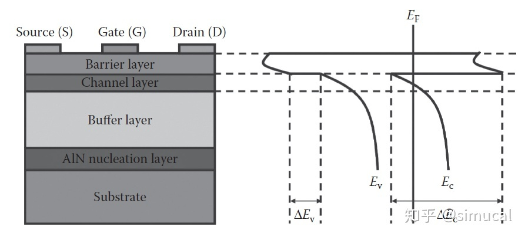
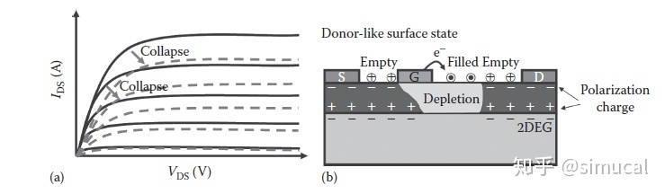

作者：simucal
链接：https://zhuanlan.zhihu.com/p/196392328
来源：知乎
著作权归作者所有。商业转载请联系作者获得授权，非商业转载请注明出处。

# HEMT 的[电流崩塌效应](https://www.zhihu.com/search?q=电流崩塌效应&search_source=Entity&hybrid_search_source=Entity&hybrid_search_extra={"sourceType"%3A"article"%2C"sourceId"%3A"196392328"})

在之前的章节中，小赛已经介绍了GaN材料中极化效应以及二维电子气（2DEG）的产生原理。因2DEGGE具有超高的沟道迁移率，所以2DGE的可以应用在高电子迁移率晶体管（HEMT）中，而本周主要介绍的是GaN基HEMT中存在的电流崩塌现象。HEMT主要是以2DEG为导电沟道中的电流载体，通过改变栅电极偏置电压控制沟道中2DEG的通断，实现对[HEMT电流](https://www.zhihu.com/search?q=HEMT电流&search_source=Entity&hybrid_search_source=Entity&hybrid_search_extra={"sourceType"%3A"article"%2C"sourceId"%3A"196392328"})的调制。由于2DEG中电子基本不受杂质散射的影响，沟道中的电子迁移率较高，所以在直流高频应用领域可以表现出优异的性能。

但HEMT仍然存在一些问题亟待解决。如下图（a）所示，可以观测到器件中源漏电流值低于理想电流值，器件通态电阻增大，这就是HEMT中的电流崩塌效应。[虚栅效应](https://www.zhihu.com/search?q=虚栅效应&search_source=Entity&hybrid_search_source=Entity&hybrid_search_extra={"sourceType"%3A"article"%2C"sourceId"%3A"196392328"})被公认为是造成电流崩塌效应的关键因素。由于AlGaN/GaN HEMT中陷阱效应的存在，从栅极中泄漏的电子会填满器件表面的陷阱，从而形成虚栅[如下图（b）所示]。虚栅可以影响耗尽区域，从而额外耗尽沟道中的电子，最终导致电流崩塌。 

本周的《涨知识啦》就到这里啦！我们下期再见！

*以上内容选自Tzou, An-Jye, et al. Principles and Properties of Nitride-Based Electronic Devices. 2017, pp. 305–327.*
