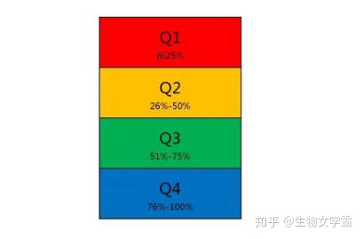
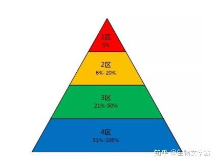
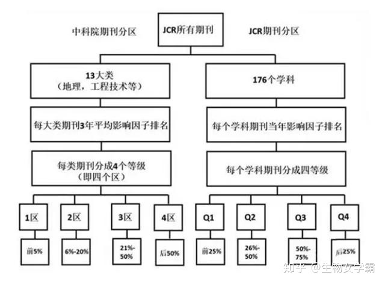
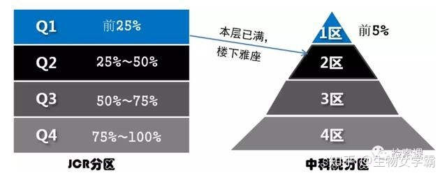

Article类型论文一般指研究者对于研究成果进行全局性的详细阐述；Review类型论文一般指研究者对前人的实验结果或某一特定研究领域科研成果的总结与评述；Letter类型论文被称为“快报”，更为注重时效性，主要是一些研究者新发现的初步结果或者一种新机制，这些初步成果可能有待进一步阐述，新机制也可能正处于研究过程之中。

**什么是期刊分区？**

关于JCR(Journal Citation Reports, 期刊引证报告) 期刊分区影响较为广泛的有两种：

一种是科睿唯安公司制定的分区(原来是汤森路透，后来易主科睿唯安)；

第二种是中国科学院国家科学图书馆制定的分区(简称中科院分区)。

这两种分区方式均基于 SCI 收录期刊影响因子基础之上进行分区的。

**SCI 是什么的简称？**

这个问题，一定要说一下，

因为学霸姐姐知道，很多人以为SCI是science的简称。。。

其实并不是，SCI全称是Science Citation Index(科学引文索引)。

是1961年由 美国科学信息研究所 创办的引文数据库，是国际公认的进行科学统计与评价的主要检索工具。

20世纪80年代末南京大学最先将SCI 引入我国的科研评价体系。

**SCI为什么要分区？**

期刊的IF每年不断浮动，把IF定值作为学术评价指标不适合，而且不同学科领域期刊的影响因子差异很大，仅凭IF不能直观地比较不同领域的期刊。

于是，把同一学科领域的期刊，按IF大到小做排序后，划分入不同区域。

那么，只要是某领域1区的期刊，就是该领域的顶级刊物，直观反映该刊在领域内的水准和大致排位。

**科睿唯安JCR分区**

科睿唯安每年出版JCR（《期刊引用报告》，全称Journal Citation Reports）。JCR将收录期刊分为176个不同学科类别，每个学科分类按照期刊的影响因子高低，平均分为4个区：

影响因子前25%（含25%）的期刊为Q1区；

影响因子位于25-50%（含50%）为Q2区；

影响因子位于50-75%（含75%）为Q3区；

影响因子位于75%之后的期刊为Q4区。

**中科院分区**

中科院首先将JCR中所有期刊分为数学、物理、化学、生物、地学、天文、工程技术、医学、环境科学、农林科学、社会科学、管理科学及综合性期刊13 大类。然后，将13大类期刊分各自为4 个等级，即4 个区。

按照各类期刊影响因子划分，前5% 为该类1 区、6% ～ 20% 为2 区、21% ～ 50% 为3 区，其余的为4 区。

**JCR分区分区 PK 中科院分区**

**1，学科划分不同**

,科睿唯安JCR的Journal Ranking没有设置大类学科，只分为176个具体学科，也就是中科院分区表中所指的小类学科。

**2，分区方法不同**

JCR是按照“平均主义”思想，根据刊物IF的高至低平均划分4个区，每个区含有该领域总量25%的期刊；

中科院的分区如同社会阶层的金字塔结构，1区只有5%的顶级期刊，2~4区期刊数量也逐层增加。

于是，采用中科院分区后往往出现“掉区”的情况。

显然中科院的1区和2区杂志很少，杂志质量相对也高，基本都是本领域的顶级期刊。

所以有的人发表的论文按JCR分区标准算一区，而按中科院分区算2区甚至三区。

**3，指标取值不同**

JCR是按当期（1年）的IF进行分区，中科院是按刊物前3年IF平均值进行分区。

**4，写法不同**

一般的，JCR中1区的期刊写作“Q1”，中科院1区的期刊写作“1区”，如此类推。

**最后的重点——我们到底该看哪个分区？**

尽管两种分区方式都比较权威，但是中科院分区被更多的机构采纳以作为科研评价的指标。

据学霸姐姐所知，国内大部分的高校和科研单位的科研业绩奖励、职称评审等，均按照中科院分区进行加权计算。

但是，由于中科院的分区遭到了很多无情的diss，

所以，现在，有些学校已经明确表示要与国际接轨，使用科睿唯安SCI期刊分区标准，

所以，具体怎么看，最好是看你们学校/单位认哪个。（说了等于没说系列。。。）