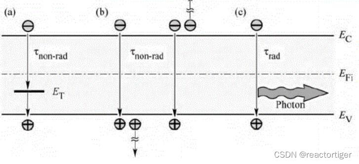
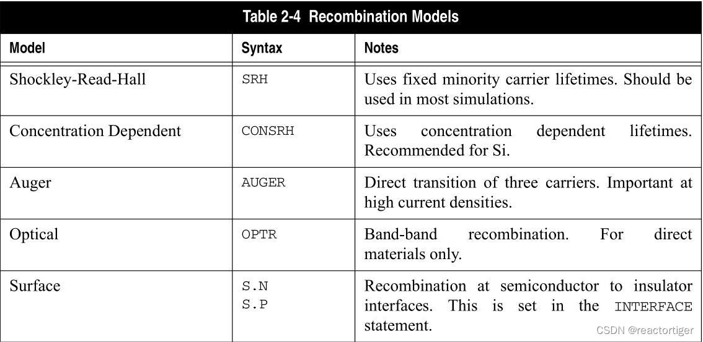
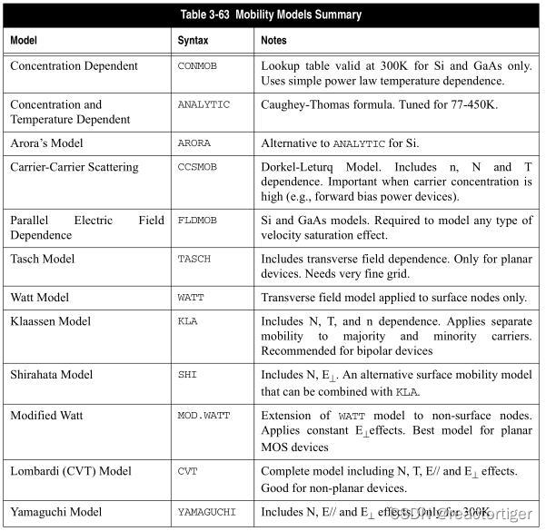
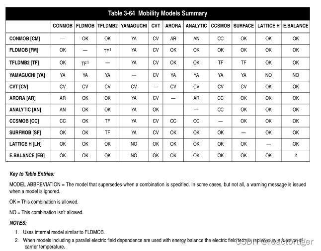

# 物理模型：载流子产生复合模型

1.根据复合过程的微观机制，可以分为：

 

直接复合：电子在导带与价带之间直接跃迁进行复合（对窄禁带半导体，直接禁带半导体材料占优势）
间接复合：通过禁带能级（复合中心，SRH复合）进行复合（少子寿命与复合中心的浓度成反比，深能级是更有效的复合中心）
2.根据复合发生的位置可以分为：表面复合、体内复合

3.根据释放能量的方式分为：

辐射复合：发射光子（e-光子）
非辐射复合：有两种主要机制，深能级复合（SRH理论）及俄歇复合。能量的释放方式为：
  （1）发射声子，能量传递给晶格，变成晶格振动（e-声子）

  （2）俄歇复合，能量传递给其他载流子（e-e, 窄禁带半导体、重掺杂材料及高温情况下起重要作用）

图中（a）间接复合，非辐射复合；（b）直接复合，俄歇复合，非辐射复合；（c）直接复合，辐射复合

4.silvaco中载流子的复合可分为：

Shockley-Read-Hall 复合模型（srh，consrh，klasrh，trap.tunnel）
俄歇复合模型（auger，klaaug）：
光学复合模型（optr）
表面复合模型（s.n，s.p，surf.rec）
陷阱复合（trap，inttrap，defect）

**导体物理的基本方程包括：**泊松方程、连续性方程、输运方程、位移电流方程等。

1. 泊松方程：描述的是电势与空间电荷密度的关系。

2. 连续性方程：描述的是栽子浓度的时空变化关系：一是载流子的产生，二是载流子的复合，三是载流子的漂移与扩散而引起。

3.输运方程：通过对玻尔兹曼输运方程的简化得到电流密度方程或电荷输运模型，这些假设可以导致许多不同的输运模型，如漂移-扩散模型、能量平衡模型、流体动力模型等。电荷输运模型的选择主要影响产生和复合模型的选择。
最简单的模型是漂移扩散模型，几乎对所有的器件都适用，但对小的特征尺寸问题不太准确。因此，更先进的能量平衡和流体动力学模型在模拟深亚微米器件方面越来越受欢迎。电荷输运模型与载流子的统计有关。
1）漂移-扩散模型：描述的是电流的产生是由漂移电流及扩散电流共同引起的。

2）能量平衡模型：一般玻尔兹曼传输方程的高阶解包括电流密度与载流子温度或能量的附加耦合，该模型修正了漂移-扩散模型的电流密度表达式，使其包含这一额外的物理关系。

4. 位移电流方程：对于时域仿真，必须包含位移电流方程

# 物理模型：迁移率模型

迁移率模型一般可以分为一下四种：

1.低场行为：此时载流子与晶格几乎处于平衡，其迁移率具有典型的低场值，一般用来表示。 低场载流子的迁移率可以采用5种不同的方式进行定义；

第一种方法使用MUN和MUP参数设置电子和空穴迁移率的常数值，并是需要指定温度相关性。
第二种方法使用查表模型(CONMOB)将300K时的低场迁移率与杂质浓度联系起来。
第三种方法是使用低场迁移率解析模型（ANALYTIC , ARORA , or MASETTI）将低场载流子迁移率与杂质浓度和温度联系起来。
第四种方法是选择载流子-载流子散射模型(CCSMOB, CONWELL或BROOKS)将低场迁移率与载流子浓度和温度联系起来。
第五种方法是采用统一的低场迁移率模型(KLAASSEN)，将低场迁移率与施主、受主、晶格、载流子-载流子散射和温度联系起来。
2.高场行为：在高电场情况下，栽子的迁移率随电场的增大而下降，其漂移速度最终达到一个饱和值，用来表示，他一般是晶格温度的函数。

3.体材料区：体材料迁移率模型涉及到（1）表征作为掺杂浓度及晶格温度的函数，（2）表征作为温度的函数，（3）描述低场迁移率与饱和速度区域之间的转换 

4.反型层：反型层的载流子会遭受表面散射、严重的载流子-载流子散射、量子尺寸的量子化效果，在MOS器件仿真中需要用到此模型。

在仿真中你可以同时用到多个不相互冲突的迁移率模型。

迁移率模型总结如下表：

 

 

 

