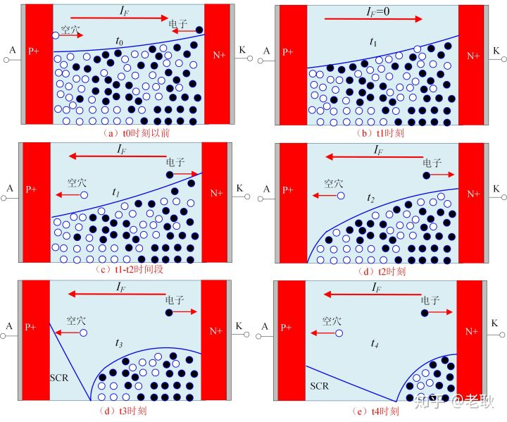

# 肖特基二极管（SBD）

SBD 器件中包含两个电极：阳极和阴极，阳极是金属半导体的肖特基接触，阴极是金属半导体的欧姆接触，这两个金属电极的研制是 SBD 器件制备过程中的关键所在，下面介绍金属半导体接触的理论基础。

在绝对零度下，金属与半导体中的费米能级$ E_F $代表电子填充能级的水平，$E_F$以下的能级全部被电子占据，$E_F$以上的能级都是空的。在不施加高温、高压等外力条件下，金属或半导体中的大部分电子保持在低能级位置，否则，电子将获得能量，不再稳定在低能级，而是向更高能级跃迁。用$E_0$ 表示电子在真空中静止时的能量，金属中的电子从 $E_F$ 跃迁到$E_0$所需要的最小能量被称为金属的功函数，用 $W_m$ 表示，即
$$
W_m=E_0-(E_F)_m
$$
类似地，当半导体中的电子获得足够的能量时也可以从半导体中逸出，半导体的功函数用$W_s$表示，计算公式为 
$$
W_s=E_0-(E_F)_s
$$
式中${(E_F)}s$代表半导体中的费米能级。 下图给出了 n 型半导体功函数与各个能级之间的关系。χ 代表电子亲合能，被定义为电子从导带底$E_C$跃迁到 $E_0$ 所需要的最小能量，计算公式如下 
$$
\chi=E_0-E_c
$$
n 型半导体的功函数与电子亲和能 χ 之间的关系可表示为
$$
W_s=\chi+[E_c-(E_F)_s]=\chi+E_n
$$

假设半导体为 n 型半导体，当金属与半导体接触时，如果$W_m>W_s$，则半导体一侧的电子会逐渐向金属一侧流动，失去电子的半导体表面呈现正电性，获得电子的金属表面呈现负电性，随着电子的不断扩散，整个系统最终达到平衡状态，即在不施加外力的条件下金属与半导体具有统一的费米能级。平衡时由于金属与半导体两侧的正负电荷而产生内部电场，电场的正方向由半导体指向金属，此电场称为内建电场，形成的电势差叫作半导体与金属的接触电势差，用$q{V_{bi}}$来表示。在半导体一侧，由于半导体表面的电子数量比半导体内部少使得表面呈现正电性，半导体表面电子能量高于体内，能带向上弯曲，形成了势垒面，阻碍了半导体内部的电子流向半导体表面，我们称其为表面势垒层，也叫阻挡层，金属和半导体形成的这种接触就是肖特基接触。

金属半导体平衡后的能带图

同样的对于n型半导体来说，当$W_m<W_s$时，电子从金属流向半导体，此时半导体内电场方向由表面指向体内，能带向下弯曲，表面的电子浓度远高于体内，形成了反阻挡层，反阻挡层对金属与半导体的接触电阻影响很小，此时形成的是金属半导体的欧姆接触。 

金属与半导体间的肖特基势垒是指金属一侧的势垒高度，对于n型半导体，根据 Schottky–Mott 理论，肖特基势垒由下式给出：
$$
q\Phi_B=q\Phi_m-\chi_s
$$
$\Phi_m$是金属的功函数，$\chi_s$是半导体的电子亲和能。

当金属接正极，半导体接负极此时结处于正偏状态。外加电压$V$后，能带不再处于平衡状态，半导体和金属之间的费米能级差等于外加的电势差，半导体一边的势垒降低$-qV$，而肖特基势垒不随电压变化，此时从半导体流向金属的电流变大，而金属流向半导体的电子不变，形成了从半导体流向金属的正向电流。电压越大，半导体势垒下降的越多，正向电流也越大，正偏时的能带图如图所示。 

当结上加反向偏压，半导体处的势垒升高，从半导体到金属的电子减少，金属到半导体的电子占优势，但是反向偏压下，金属电子需要翻越很高的肖特基势垒$q\Phi_B$才能到达半导体，所以这一部分电子是很少的。随着电压的增大，半导体流向金属的电子可以忽略不计，此时反向电流趋向饱和值。反偏时的能带图如图所示。

热电子发射理论的主要原理是，如果对半导体施加外力作用，半导体一侧的电子将获得能量，当能量足够高时，电子将会克服势垒的作用进入到金属一侧，形成导通电流[41]。另外，电子也可以通过隧穿的方式越过势垒到达金属，这是由于通常情况下AlGaN 势垒层的厚度（20～30nm）较小，电子在没有获得足够多热量的情况下，也有一定的几率隧穿而过，即隧穿机制，同时，半导体材料体内缺陷的存在也为电子隧穿提供了有力条件[42]。

作者：硬件工程师炼成之路
链接：https://zhuanlan.zhihu.com/p/368078363
来源：知乎
著作权归作者所有。商业转载请联系作者获得授权，非商业转载请注明出处。

大学模电里面没有[肖特基二极管](https://www.zhihu.com/search?q=肖特基二极管&search_source=Entity&hybrid_search_source=Entity&hybrid_search_extra={"sourceType"%3A"article"%2C"sourceId"%3A"368078363"})的内容，然而在实际工作中，肖特基二极管甚至比普通二极管用得还要多。

与此同时，**肖特基二极管和PN结二极管的工作原理是完全不同的**。

这节就来简单说一说我对**肖特基二极管工作原理**的理解。

**肖特基二极管的工作原理**

肖特基二极管，本质上就是金属和半导体材料接触的时候，在界面半导体处的能带弯曲，形成了**[肖特基势垒](https://www.zhihu.com/search?q=肖特基势垒&search_source=Entity&hybrid_search_source=Entity&hybrid_search_extra={"sourceType"%3A"article"%2C"sourceId"%3A"368078363"})**。

这个定义比较官方，估计看一眼就忘记了。

**那么如何通俗理解呢？**

**其实就是金属和半导体接触的时候，电子会从半导体跑到金属里面去。半导体失去电子，就会带正电，形成空间电荷区（不可移动的[正离子](https://www.zhihu.com/search?q=正离子&search_source=Entity&hybrid_search_source=Entity&hybrid_search_extra={"sourceType"%3A"article"%2C"sourceId"%3A"368078363"})构成），这个空间电荷区，会阻止半导体的电子继续向金属移动，也就是说形成了肖特基势垒。**

当在这个势垒上面加上正向电压（金属电压>半导体电压），那么半导体和金属之间的势垒就降低了。如此一来呢，电子就会从半导体流向金属，从而形成正向电流。

反之，当加上反向电压，势垒被加大，电流基本为0，也就是说反偏截止了。

这，就是肖特基二极管的工作原理。

**估计会有疑问：扩散不是从浓度高向浓度低的方向扩散？怎么会是金属失去电子呢？金属的自由电子那么多，搞错了？**

错当然是没错，这个时候是**不能用扩散**来解释的。

**那怎么解释呢？**

这么理解吧，一个金属块，里面有很多自由电子，我们称它们“自由”，说的是它们在这个金属块里面可以自由的移动，只有加一点点电压，电子就能在金属块内运动。

但是如果想让它们脱离金属，飞到真空中去，这个应该是挺难的吧。难归难，就有一个参数衡量到底有多难，那就是**功函数**。

**功函数也叫逸出功**，就是把电子从固体内部弄到外部去，所需的最少的能量。

事实表明，这个能量，金属要比半导体（半导体称为电子亲合能）要大。所以，电子更难脱离金属，而半导体相对容易一点。

因此，金属与半导体搞到一起的时候，是金属得到电子。

**估计又有人说：话都让你说了，PN结用浓度差扩散理论。**

**现在肖特基结，你又搞出个逸出功，得出另外一个结论，你长得帅，说什么都对？**

虽然我长得不帅，但事实就是如此。

P型半导体，N型半导体，里面其实绝大多数都是硅原子，只是掺杂了少许杂质，它们的主要特性没有变化，就是硅晶体。

因此，**可以看作是同一种材料**。

而**金属和半导体，它们完全是两种材料**，得失电子就要考虑逸出功。

其实，P型半导体和N型半导体，我们也是可以考虑逸出功的。只不过它们可以看作是一种材料，逸出功是一样的，也就是没有影响，所以一般也就不提了，主要考虑扩散作用了。

**问题又来了：你说金属与半导体接触会形成肖特基二极管，那我们实际用的PN结二极管，焊接的两个管脚是金属导体吧，而里面又是半导体。**

**所以肯定有金属和半导体接触吧，怎么没听说形成了肖特基二极管？**

这里呢，需要说明一下，金属与半导体相接触，并不是一定会形成二极管。

在N型半导体掺杂很高的时候，形成的势垒会**非常的薄**，这时的电子呢，可以通过[隧道效应](https://www.zhihu.com/search?q=隧道效应&search_source=Entity&hybrid_search_source=Entity&hybrid_search_extra={"sourceType"%3A"article"%2C"sourceId"%3A"368078363"})直接就穿过这个薄的势垒了。

这时候，这个势垒就相当于是一个低阻值的电阻了，没有二极管的整流特性。这种接触称为**[欧姆接触](https://www.zhihu.com/search?q=欧姆接触&search_source=Entity&hybrid_search_source=Entity&hybrid_search_extra={"sourceType"%3A"article"%2C"sourceId"%3A"368078363"})**。

而掺杂低的时候，形成的**势垒相对较宽**，电子就不能因为隧道效应越过势垒区了，这时候会形成二极管，这种金属-半导体接触就叫**肖特基接触**。

**肖特基二极管为什么速度快**

**都知道肖特基二极管比普通的二极管的速度更快，那为什么呢？**

通过我们前面的文章知道，普通二极管的速度慢，其原因就是因为有**反向恢复时间**，而反向恢复时间是因为**少数[载流子](https://www.zhihu.com/search?q=载流子&search_source=Entity&hybrid_search_source=Entity&hybrid_search_extra={"sourceType"%3A"article"%2C"sourceId"%3A"368078363"})的存储作用**导致的。

不清楚的话，可以点下面的链接再看看。

[    链接：二极管结电容和反向恢复时间都是怎么来的](http://mp.weixin.qq.com/s?__biz=Mzk0NjIxODM3Mg==&mid=2247486032&idx=1&sn=c5914639bf986a8d963f862764d3c774&chksm=c3083ebbf47fb7ad7c420e91195dc98a50b7cdbd2f8ddd0dcf1dc82a0839d2bc13c208ae87b2&scene=21#wechat_redirect)

而从肖特基二极管的工作原理可以看出，**它只有一种载流子**，那就是电子，也是多子。

所以就不存在反向恢复时间了，或者说反向恢复时间很短吧。

大家好，上周我们聊了PiN二极管的正向恢复特性，这期我们详细讨论一下PiN二极管的反向恢复特性以及在应用中的注意事项。

首先，看一下PiN二极管在什么情况下会产生反向恢复？***二极管发生反向恢复的条件是它正在导通的时候，突然承受反向电压被迫关断。***在这里我们还是以经典的双脉冲测试电路为例进行说明，如图1所示。

图1 双脉冲测试电路

我们对下管S2实施双脉冲测试，S2的第一个触发脉冲，集电极电流*iC*2从0开始上升，S2关断后，负载电流*i*load会通过上管S1的续流二极管D1续流。当S2再次开通时，二极管D1满足了发生反向恢复的条件。D1的反向电流*iD*1叠加上负载电流*i*load就会在S2的集电极电流上表现为电流尖峰，如图2所示。

图2. 双脉冲测试波形（图片来源于“IGBT双脉冲测试方法”作者：魏炜）

关于二极管反向恢复特性更为详细的测试说明，大家可以百度搜索大牛魏炜写的“IGBT双脉冲测试方法”，这里就不详细介绍了。在分析反向恢复过程时，希望大家时刻要记住两个最基本的电路概念：***其一就是负载电感电流不能突变，另外一个就是基尔霍夫电流定律。***理解了这两个概念后，从电路的角度去理解二极管的反向恢复过程就很简单了。

这时候你可能会问“***二极管反向恢复的瞬间会不会造成桥臂直通啊？”***是的，当然会了。虽然是“桥臂直通”，但是没有危险，因为时间太短了，也就在100-300ns左右（跟器件特性有关）。这个时间和我们所说真正的桥臂短路时间（10us左右）还不是一个数量级。

对于二极管反向恢复更通俗的理解就是***二极管在关断瞬间并没有立马截止掉，反向泄漏一部分电流（电荷），泄完后才算是正式关断了。\***

从电路角度理解了二极管的反向恢复过程后，肯定还有部分小伙伴不满足，那我们再从半导体物理学的角度简单解释一下。

在讲到二极管的正向恢复过程时，我们提到过由于“电导调制”现象的存在，PiN二极管完全导通后，内部的N-基区充满了大量的自由载流子。***而二极管的反向恢复过程就是将N-基区的这些载流子的移出过程，因为只有将这些载流子清除完后，N-基区才能够形成承受高电场的耗尽层。***

为了更清晰的分析PiN二极管的反向恢复机理，我们将二极管的反向恢复过程分为5个阶段，如图3和图4所示[1]。

图3.PiN二极管反向恢复电压和电流

图4.PiN二极管反向恢复过程载流子浓度变化

① t0时刻以前，D1处于正向导通状态（续流状态），内部N-基区充满了自由载流子。

② t0时刻开始，电流换向开始，D1正向电流*iD*1逐渐减小（S2电流*iC*2开始上升），在t1时刻D1电流减小至0（S2电流上升至负载电流*i*load）。

③ t1时刻开始，D1出现反向电流，空穴流向阳极，电子流向阴极（与开通时候的方向相反），此时内部N-依然充满了自由载流子，保持电中性，因此二极管并没有承受反向电压。

④ t2时刻，P+N-结处剩余载流子浓度衰减为零，开始形成耗尽层，二极管开始承受反向电压。随着耗尽层的扩展，t3时刻，二极管反向电压达到母线电压Vdc，在t3时刻，di/dt=0，二极管反向恢复电流达到最大值。

⑤ t3时刻开始，反向电流逐渐衰减，此时dir/dt变负，并在回路杂散电感上建立起一个负电压，使二极管的端电压出现超调， t4时刻为反向电压达到峰值。

⑥ 随着二极管的反向电流逐渐降为0，反向恢复dir/dt 也减至零，二极管的端电压亦降为Vdc,至t5时刻，二极管的关断过程结束。t5时刻过后，可能还有很小的拖尾电流，类似于IGBT关断拖尾一样，主要取决于内部载流子的寿命。

更为形象的载流子分布如图5所示。

图5.PiN二极管反向恢复过程载流子变化

对二极管的反向机理有了大致了解后，再回到应用，在这里有几个知识点我们需要强调一下：

① t0-t2时刻的换向di/dt，也称为前向di/dt（实际上就是S2的开通di/dt），主要与外电路相关，影响因素有换流回路杂散电感，母线电压，以及IGBT开通特性。

很多书籍上给的公式是：

需要说明的是，该公式成立的前提是把S2当作理想开关来对待的，然而实际上很难成立，大家看看IGBT开通暂态的集电极电压缺口应该就知道了，这个缺口电压正是杂散电感上的电压。如果大家把IGBT开通电阻搞小，回路的杂散电感搞大，这个公式就成立了，至于为什么大家可以去想想哦。

② t3-t5时刻电流反向恢复dir/dt，也可以称为后向di/dt，主要与器件的特性有关，如果衰减的很快，我们称之为***Snappy Recovery\***。中文可以翻译为刚性反向恢复特性或硬反向恢复特性。关断太硬的话，一方面由于杂散电感的作用，会在二极管上叠加一个电压尖峰；另一方面还容易产生电流震荡和电磁干扰（EMI）。图6就是一个典型的snappy recovery波形，可以看到，二极管的反向压降超出母线电压很多，并且伴随着严重的振荡。

图6.Snappy recovery 波形

需要说明的是，并不是所有的反向恢复过程都会造成二极管的过电压，二极管两端的电压由公式2决定：

③ 反向恢复损耗的概念可能大家都比较清楚了，二极管的反向恢复电流乘以反向电压就是二极管的瞬时功率，在反向恢复时间内对二极管的瞬时功率积分就可以得到二极管的反向恢复损耗，典型的测试波形如图7所示。

图7 二极管反向恢复波形（图片来源于“IGBT双脉冲测试方法”注解：老耿）

需要说明的是，二极管在开通和关断转换过程中瞬时功率不能超出安全工作区（Safe of area, SOA），否则器件有失效风险。图8为infineon 3.3kV 1.2kA 二极管的安全工作区。大家可能会注意到现在很多IGBT模块内部的续流二极管并没有给出SOA曲线，具体原因就不清楚了，有可能由于现在的器件工艺改进，很难出现器件超出SOA的情况了吧。

图8. 二极管SOA,DD1200S33K2C

影响二极管反向恢复特性的内部机理是比较复杂的，有时候你可能会***发现在低温、小电流的时候反向恢复特性会变差，振荡也会更加严重，当电流增大后，反向恢复特性又会变好***。至于为什么会产生以上现象，要讲的东西太多了，我们以后有机会在详细讨论吧！

对于我们做应用的还是以**测试**为主，不同厂家的模块特性不一样，同一厂家不同系列的模块也会不一样，因此拿到一个新的模块一定要去做测试，把器件的特性摸透了，你设计的产品才会可靠。

好了，今天就给大家分享到这里，纸上得来终觉浅，小伙伴们赶快去搭个双脉冲测试电路对你们用的续流二极管来个全面测试吧！

想了解更多电力电子硬件相关知识，请微信搜索公众号“耿博士电力电子技术”，每周更新，带你畅游电力电子技术海洋

部分图片来源于网络，如有侵权，请联系作者删除！

参考文献：

[1] M. T. RAHIMO. “A comprehensive study of failure mode in IGBT applications due to freewheeling diode snappy recovery”. 2005

[2] B. Jayant Baliga “Fundamentals of Power Semiconductor Devices”. 2008, pp-110.

[3] Josef Lutz, Schlangenotto, Uwe Scheuermann, and Rik De Doncker. “Semiconductor Power Devices: Physics, Characteristics, Reliability”.

上期内容，我们主要举例说明了，二极管的反向恢复时间并不等于规格书中结电容的充放电时间。这个结论是从二极管的规格书参数中直接得来的，并没有正面说明为啥。

下面就来**正面刚****…**

 

**结电容**

先说结电容。

二极管是两个管脚的器件，说来不怕丢人，**我曾误以为**：二极管的结电容就是它的两个管脚形成的寄生电容，因为两个极板放到一起，就构成了一个电容。

当然了，两个管脚确实会形成电容，不过这个电容很小，相比结电容来说，可以忽略不计了。

那结电容到底指的是什么呢？所有的道理，其实都在PN结里面，我们稍稍深入了解下PN结，答案就出来了。

**结电容有两种，分别是势垒电容和扩散电容**。

**势垒电容**

我们知道，P区空穴多，N区电子多，因为扩散，会在中间形成内建电场区。N区那边失去电子带正电荷，P区那边得到电子带负电荷。

当给PN结加上稳定的电压，那么稳定后，内建电场区的厚度也会稳定为一个值，也就是说内部电荷一定。如果PN结上的电压向反偏的方向增大，那么内建电场区厚度也增加，即内部电荷增多。反之，如果电压减小，那么内部电荷减少。

这样一看，不就和电容充放电现象一样吗？

**PN****结两端电压变化，引起积累在中间区域的电荷数量的改变，从而呈现电容效应，这个电容就是势垒电容**。

**上面是对结电容的理解，那么这个结电容大小等于多少呢？如下图**

我们知道，势垒宽度，也就是内建电场区的宽度，是与电压相关的。所以说，**不同的电压下，势垒电容的大小也是不同的**。

所以，当你随意翻开某二极管的规格书，你看到的结电容参数，它会指定测试条件。通常这个条件是1MHz，电压为-4V（反偏）。

**事实表明，二极管在反偏时，势垒电容起主要作用，而正偏时，扩散电容起主要作用**。下面看看扩散电容。

**扩散电容**

相比与势垒电容，扩散电容要更难以理解。

我先摆出文字定义

**扩散电容：当有外加正向偏压时，在 p-n** **结两侧的少子扩散区内，都有一定的少数载流子的积累，而且它们的密度随电压而变化，形成一个附加的电容效应，称为扩散电容**。

下面看看这一段话怎么理解。

当PN结加上正向电压，内部电场区被削弱，因为浓度差异，P区空穴向N区扩散，N区的电子向P区扩散。

扩散的空穴和电子在内部电场区相遇，会有部分空穴和电子复合而消失，也有部分没有消失。没有复合的空穴和电子穿过内部电场区，空穴进入N区，电子进入P区。

进入N区的空穴，并不是立马和N区的多子-电子复合消失，而是在一定的距离内，一部分继续扩散，一部分与N区的电子复合消失。

显然，N区中靠近内部电场区处的空穴浓度是最高的，距离N区越远，浓度越低，因为空穴不断复合消失。同理，P区也是一样，浓度随着远离内部电场区而逐渐降低。总体浓度分布如下图所示。

当外部电压稳定不变的时候，最终P区中的电子，N区中的空穴浓度也是稳定的。也就是说，P区中存储了数量一定的电子，N区中存储了数量一定的空穴。如果外部电压不变，存储的电子和空穴数量就不会发生变化，也就是说稳定存储了一定的电荷。

但是，**如果电压发生变化**，比如正向电压降低，电流减小，单位时间内涌入N区中的空穴也会减小，这样N区中空穴浓度必然会降低。同理，P区中电子浓度也降低。所以，稳定后，存储的电子和空穴的数量想比之前会更少，也就是说存储的电荷就变少了。

这不就是一个电容吗？**电压变化，存储的电荷量也发生了变化，跟电容的表现一模一样，这电容就是扩散电容了**。

那这个电容大小是多少呢？

**扩散电容随正向偏压按指数规律增加**。这也是扩散电容在大的正向偏压下起主要作用的原因。

如上图，二极管的电流也与正向偏压按指数规律增加，所以，**扩散电容的大小与电流的大小差不多是正比的关系**。

**问题困扰**

关于扩散电容，曾经有一个问题困扰了我：**为什么是少数载流子的积累呈现电容效应？多子不行吗？**

少数载流子，指的是N区中的空穴，P区中的电子。要知道，N区中有更多的电子，就因为P区中的空穴扩散到N区，N区就带正电了吗？

事实确实是如此的，这需要我们发挥下想象力。

假如没有扩散作用，N区中电子是多子，且电子带负电，但是**整个****N****区是电中性的**，因为N区是硅原子和正五价原子构成，它们都是中性的。同理P区中空穴是多子，整体也是电中性的。

现在将N区和P区放到一起，并加上正电压，就有了正向电流。N区的电子向P区移动，P区的空穴向N区移动，如果电子和空穴都在交界处复合消失，那么N区和P区还是电中性的。

但事实是，电子和空穴有的会擦肩而过，电子会在冲进P区，空穴也会冲进N区。尽管P区有很多空穴，电子进入后也不会马上和空穴复合消失，而是会存在一段时间。这时如果我们看P区整体，它不再是电中性了，它有了净电荷。电荷数量就是还没有复合的电子数量，也就是少数载流子的数量。同理，N区也有净电荷，为少数载流子空穴的数量。

所以说，**扩散电容是少数载流子的积累效应**。

**事实表明，PN结正偏的时候，结电容主要是扩散电容，PN结反偏的时候，结电容主要是势垒电容**。

说我二极管的结电容，再来看看反向恢复时间。

 

**反向恢复时间**

由PN结构成的二极管都会有一个trr的参数，这个参数就是二极管的反向恢复时间。

从上一节内容我们知道，trr这个参数决定了二极管的最高工作频率。

**那反向恢复时间到底是怎么来的呢？**我们来看下面这个图

**在t****＜0****时**，二极管接正向电源，正向电流为（Vf-Va）/Rf。

可以想象，此时PN结处充斥的很多的载流子，也就是存储了很多的电荷。

如果我们开启上帝视角，会发现，整个PN结，包括内建电场区，到处都有载流子存在。也就是说，现在整个PN结相当于是良导体，如果电源迅速反向，电流也是可以迅速反向的。

**在t=0****时**，**二极管接反向电源，但是此时****PN****结正偏的特性不会马上改变**。

为什么PN结的正偏特性不会改变呢？

可以这么看，PN结反偏时内建电场区是基本没有电荷的，很明显，现在存了很多电荷，不把这些电荷搞掉，正偏特性不会变化的。也可以理解为是结电容导致电压不能突变，电荷没放完，结两端的电压就不会变反向。

与此同时，因为存储了大量电荷，此时PN结可以看成良导体，电流立马反向，反向电流为（Vr+Va）/Rr。

不过需要注意，这时电流的成因是少数载流子反向运动的结果，随着时间推移，少数载流子数量是越来越少的。

**在t=ts****时**，PN结中心处少数载流子被消耗光了，此时PN结的内建电场区开始建立，二极管开始恢复阻断能力。在这之后，P区和N区剩余的载流子已经不能反向运动了，因为中间断了。不过，P区和N区还有剩余的载流子存在，并不为0，几个时刻的载流子浓度分布如下图。

**在t>ts****之后**，中间被阻断，那是不是整体电流就立马下降到0呢？其实不是的，电流还是存在的，因为P区和N区各自剩余的少数载流子并没有达到热平衡，最终会复合消失，这个复合会产生电流。

这个可能不好理解，中间都断了，不允许电荷穿过，怎么还能有电流呢？

我是这么想的，P区剩余的少数载流子是电子，前面说过，这导致P区整体看起来带负电。复合完成之后，P区整体是不带电的，这些电荷必然是慢慢回到了电源，那自然就有了电流。

**这类似于电容充放电会形成电流，电容充放电时，两极板中间绝缘，也不会有电荷移动**。

所以，尽管中间阻断了，也还是有电流的，只有当重新达到热平衡，复合电流才会为0。

整个过程，电源电压，二极管两端电压，反向电流的波形图如下所示，图中的**trr****就是反向恢复时间**

如果上网多看看的话，我们有时也会看到这样的图，二极管反向电流最大值的地方并不是平的，并且二极管两端电压会出现反向尖峰。

那到底哪个图是对的呢？

其实，这个差异，仅仅只是电路的不同。如果看明白前面说的二极管反向恢复电流的形成过程，这个图也就能理解了。

前面画的波形，我们的电路中串联有电阻，当没有这个电阻的时候，或者说电阻很小的时候。反向电流会非常大，而从正向电流变为反向电流，这需要时间，这会导致di/dt非常大。此时，电路中的电感就不能忽略了，因为有电感的存在，导致二极管两端会存在比电源还大的电压，也就是反向电压尖峰。

整个过程如下：

在t<0时，电感有正向的电流。

在t=0时，电源突然反向，因为二极管内部充满电荷，此时相当于导体，所以压降很小，这导致反向电压全都落在了电感上面，因此电流以斜率为di/dt=(Vr+Va)/L下降。

在t=ts时，二极管开始恢复阻断能力，此时电流达到最大，随后反向电流会下降。

在t>ts后，二极管的电流为复合电流，随着载流子越来越少，电流也越来越小。此时电感会阻碍电流变小，因此会产生反向感应电压，这会导致在二极管两侧的反向电压比电源电压还大，也就是会出现反向电压尖峰Vrm。随着时间越来越长，复合电流基本为0了，电感电压也就基本为0了，此时二极管两端电压也就等于电源电压Vr。

总的来说，**反向恢复时间就是正向导通时****PN****结存储的电荷耗尽所需要的时间**。

因此，就很容易明白下面这些：

**1****、反向电源电压越小，反向恢复电流越小，电荷耗尽越慢，反向恢复时间越长。**

**2****、正向电流越大，存储的电荷越多，耗尽时间越长，反向恢复时间越长。**

**3****、半导体材料的载流子复合效率越低，寿命越长，电荷耗尽时间越长，反向恢复时间越长。**

 

**结尾**

本文主要说明了二极管的结电容由扩散电容和势垒电容构成，以及它们形成的原理。还有就是二极管的反向恢复过程是怎么样的。

**勘误**

上一节我们说**二极管的反向恢复时间不是由结电容决定的**，**这个说法需要纠正下**。如果说反向恢复时间，就是正向导通时PN结存储的电荷耗尽所需要的时间，那这跟扩散电容还是有很大的关系的。

考虑到**我们能从规格书中看到的结电容参数，其实是二极管在反偏下的**，这个电容其实主要是势垒电容，跟扩散电容基本没毛关系，因为反偏时电流非常小，那电荷存储就更小了。

所以就纠正为下面这句话吧：

**一般二极管规格书中，标注的结电容主要是势垒电容，它跟反向恢复时间基本没关系****。**

 

**资料分享**

如果想要更深入的了解，这里有几份资料，它们也是我这篇文章的主要参考，大家可以自行下载。还是老规矩，在我的**公众号后台回复“器件”**，找到二极管文件夹，都在那里面了。

 

写这个文章，真的要吐血而亡了，耗费了我大量的时间。因为很多我原来也是不理解，光是弄明白就查了很多，耗费了很多时间，再者，这些图片是没有现成的，我只能一个一个画。**所以****….****你不留下点足迹再走吗？**
