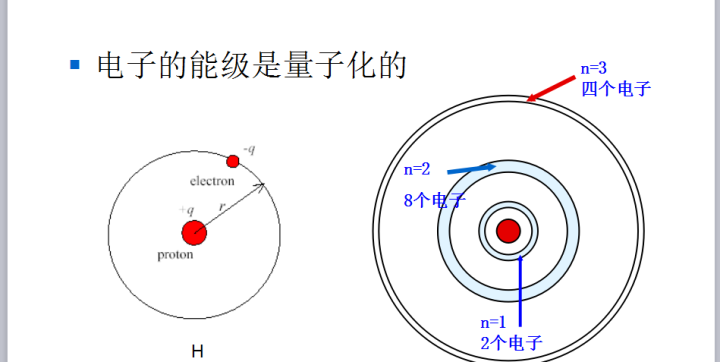
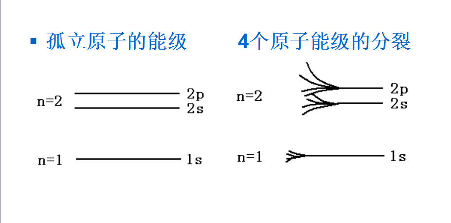
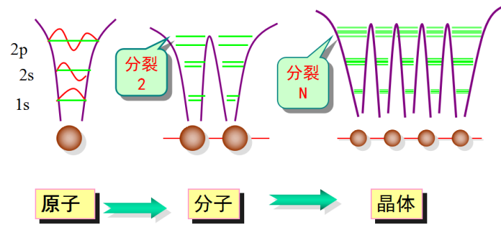
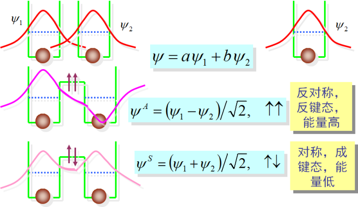
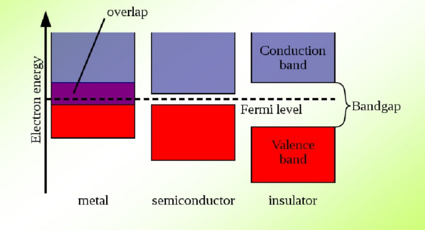
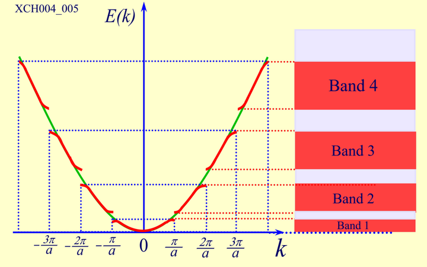

# 半导体物理基础

## 能带理论

能带论是目前研究固体中的电子状态，说明固体性质最重要的理论基础。它的出现是量子力学与量子统计在固体中的应用的最直接、最重要的结果。能带论成功地解决了Sommerfeld自由电子论处理金属问题时所遗留下来的许多问题，并为其后固体物理学的发展奠定了基础。

能带论的基本出发点是认为固体中的电子不再是完全被束缚在某个原子周围，而是可以在整个固体中运动的，称之为共有化电子。但电子在运动过程中并也不像自由电子那样，完全不受任何力的作用，电子在运动过程中受到晶格原子势场的作用。

能带论的两个基本假设：

**Born-Oppenhaimer 近似（玻恩-奥本海默绝热近似）**

所有原子核都周期性地静止排列在其格点位置上，因而忽略了电子与声子(声子（Phonon）是一种非真实的[准粒子](https://baike.baidu.com/item/准粒子?fromModule=lemma_inlink)，是用来描述晶体[原子热](https://baike.baidu.com/item/原子热?fromModule=lemma_inlink)振动——[晶格振动](https://baike.baidu.com/item/晶格振动/9219115?fromModule=lemma_inlink)规律的一种能量[量子](https://baike.baidu.com/item/量子/135660?fromModule=lemma_inlink)，它的能量等于*ħωq*。)的碰撞。

> 在统计物理、固体物理中，讨论晶格布里渊区时假定晶格中的原子在平衡位置静止不动。实际上晶体中的原子进行着热振动。这对电子的运动将产生一定的影响。由于原子核的质量比电子的质量要大得多，所以其运动速度比电子慢得多。
> 由于电子的质量比原子核质量远小得多，所以可以把电子和原子核的运动分开处理，即只考虑原子核对电子的库仑作用，不考虑其他两者的作用，相当于原子核对电子只提供外势.
> 在B-O近似下，晶体的由电子和原子核形成的多体系统转化为晶格上原子核的经典力学运动和多电子的量子力学运动.原子核的运动近似为简谐振动，简谐振动可以看做许多格波的线性叠加，格波的量子是声子；而相互作用多电子体系用薛定谔方程描述.

**Hatree－Fock平均场近似**

忽略电子与电子间的相互作用，用平均场代替电子与电子间的相互作用。即假设每个电子所处的势场完全相同，电子的势能只与该电子的位置有关，而与其他电子的位置无关。

**能带的形成**

孤立原子中电子的分立能级

多原子系统电子能级的分裂

晶体中能带的形成

一维能带结构扩展布里渊区表示

在单原子中电子能级是分立的，这一点是基于量子力学的描述，否则按照经典物理描述能级就是连续的。在晶体中，由多个原子的共同作用使得单能级分裂为N个能级，看起来这些能级就像连续分布的的，我们就叫它能带。于是我们才有了价带、导带、禁带的概念。

(1)导带conduction band

导带是由自由电子形成的能量空间。即固体结构内自由运动的电子所具有的能量范围。对于金属，所有价电子所处的能带就是导带。　　

对于半导体，所有价电子所处的能带是所谓价带，比价带能量更高的能带是导带。在绝对零度温度下，半导体的价带(valence band)是满带，受到光电注入或热激发后，价带中的部分电子会越过禁带(forbidden band/band gap)进入能量较高的空带，空带中存在电子后即成为导电的能带——导带。

施主与受主：对于掺杂半导体，电子和空穴大多数是由杂质来提供的。能够提供电子的杂质称为施主；能够提供空穴的杂质称为受主。施主的能级处在靠近导带底的禁带中；受主的能级处在靠近价带顶的禁带中。实际上未掺杂半导体的费米能级在价带和导带的中央附近。n型半导体的费米能级在导带底附近，而p型在价带顶附近。

势能/动能：导带底是导带的最低能级，可看成是电子的势能，通常，电子就处于导带底附近；离开导带底的能量高度，则可看成是电子的动能。当有外场作用到半导体两端时，电子的势能即发生变化，从而在能带图上就表现出导带底发生倾斜；反过来，凡是能带发生倾斜的区域，就必然存在电场（外电场或者内建电场）。

**价带与禁带**

价带（valence band）或称价电带，通常是指半导体或绝缘体中，在0K时能被电子占满的最高能带。对半导体而言，此能带中的能级基本上是连续的。全充满的能带中的电子不能在固体中自由运动。但若该电子受到光照，它可吸收足够能量而跳入下一个容许的最高能区，从而使价带变成部分充填，此时价带中留下的电子可在固体中自由运动。

禁带(Forbidden Band) 常用来表示价带和导带之间的能态密度为零的能量区间。禁带宽度的大小决定了材料是具有半导体性质还是具有绝缘体性质。半导体的禁带宽度较小，当温度升高时，电子可以被激发传到导带，从而使材料具有导电性。绝缘体的禁带宽度很大，即使在较高的温度下，仍是电的不良导体。无机半导体的禁带宽度从0.1～2.0eV，π-π共轭聚合物的能带隙大致在1.4～4.2eV,绝缘体的禁带宽度大于4.5eV。

（3）导带与价带的关系：

“电子浓度=空穴浓度”，这实际上就是本征半导体的特征，因此可以说，凡是两种载流子浓度相等的半导体，就是本征半导体。

注意：不仅未掺杂的半导体是本征半导体，就是掺杂的半导体，在一定条件下（例如高温下）也可以转变为本征半导体。

空穴，载流子：价带中的许多电子（价电子）并不能导电，而少量的价电子空位——空穴才能导电，故称空穴是载流子。空穴的最低能量——势能，也就是价带顶，通常空穴就处于价带顶附近。

禁带宽度：价带顶与导带底之间的能量差，就是所谓半导体的禁带宽度。这就是产生本征激发所需要的最小平均能量。

能隙（Bandgap energy gap）能带隙，在固态物理学中泛指半导体或是绝缘体的价带（valence band）顶端至传导带（conduction band）底端的能量差距。

## 其他

### 费米狄拉克分布

[热力学统计笔记](https://zhuanlan.zhihu.com/p/392613936)

### 陷阱效应

### 产生和复合

### 平衡态和非平衡态

处于热平衡状态时，载流子浓度不变的状态称为平衡态

### 界面态

是指存在于硅-二氧化硅界面处，电子密度最大，即电子被局限在表面附近的一种状态。同样在两种不同固体相接触的界面上,如金属-半导体界面、半导体-绝缘体界面、半导体-半导体异质结界面,也存在局域的电子态,称为界面态.在金属-半导体界面上,由于金属中电子波函数可以延伸到半导体的能隙中,从而产生了局域于界面上的电子态,这些态不能在金属和半导体中传播,它们向界面两侧指数衰减,这与表面态的物理本质是相似的.金属-半导体的界面态与Schottky势垒的形成密切相关

#### 直接复合

#### 间接复合

#### 表面复合

### 

#### 俄歇复合

电子和空穴复合时，把多余的能量传给第三个载流子。
获得能量的载流子又会产生多声子过程。这种复合称为俄
歇复合。

### 鲁棒性和稳定性

所谓“鲁棒性”，是指控制系统在一定（结构，大小）的参数摄动下，维持其它某些性能的特性。

所谓“稳定性”，是指控制系统在使它偏离平衡状态的扰动作用消失后，返回原来平衡状态的能力。

### 非简并/简并半导体

简单来说：非简并半导体一般都为低掺杂，费米能级位于导带和价带之间。

定性的说法：掺杂浓度很高，半导体开始表现出不像半导体而像金属的行为，具有很高的[载流子](https://www.zhihu.com/search?q=载流子&search_source=Entity&hybrid_search_source=Entity&hybrid_search_extra={"sourceType"%3A"article"%2C"sourceId"%3A"436659016"})浓度和导电性。ITO就是常见的简并半导体，具有很好的导电性。

定量的说法：

我们知道费米-狄拉克分布函数为：
$$
f(E)=\frac{1}{1+e^{\frac{E-E_F}{kT}}}
$$
在推导电子或者空穴浓度的时候，我们采用的[玻尔兹曼分布](https://www.zhihu.com/search?q=玻尔兹曼分布&search_source=Entity&hybrid_search_source=Entity&hybrid_search_extra={"sourceType"%3A"article"%2C"sourceId"%3A"436659016"})近似替代费米-狄拉克分布函数：
$$
f(E)=e^{-\frac{E-E_F}{kT}}
$$
该假设成立的条件是：$E-E_F>3kT$ ，因为 $e^3\approx20>1$ ，可以忽略费米-狄拉克分布分母前面的1。

因此，对于非简并半导体，就要求$E_C-3kT<F_F<E_V+3kT$  ，如下图所示。

半导体能带示意图：当费米能级位于E1和E2之间时，半导体是非简并的；当费米能级位于E1和E2区间之外时，半导体是简并的。

满足非简并半导体的条件，就可以得到： 
$$
n=N_Ce^{-\frac{E_C-E_F}{kT}}
$$

$$
p=N_Ve^{-\frac{E_F-E_V}{kT}}
$$

从而有质量作用定律：
$$
np={n_i}^2N_CN_Vexp(-\frac{E_g}{kT})
$$
而非简并条件下，得不到类似的表达式，也就没有质量作用定律的存在。

另外，当掺杂浓度很大时，杂质之间的距离变得非常近，彼此之间产生相互作用，局域的杂质能级变成了能带，形成半导体的带尾，所以半导体的能隙也就相应的减小了，即简并掺杂会导致半导体能隙变小。

### 费米能级

首先从量子力学的基本假设——不连续性可以推出原子外电子的在条件一定的情况下只能取到某些特定的能量，这就是**能级**：

（大家好，我是氢原子的[电子能级](https://www.zhihu.com/search?q=电子能级&search_source=Entity&hybrid_search_source=Entity&hybrid_search_extra={"sourceType"%3A"answer"%2C"sourceId"%3A"52980207"})）

当体系中有很多个原子的时候，由于原子间的相互作用，原子的能级会发生移动。原本相同的一条能级变成了一组差别很小的能级，这就是**能带**，也就是**允带**。由于能带内不同能级的能量差别非常小，所以很多时候在能带内可以忽略间隔，认为能量是连续的。

（在微扰影响下，左侧的能级扩展成了右侧的能带）

由于能带是由能级扩展而来，能带和能级一样，相互之间存在没有能级的间隔，这个间隔就是**禁带**，电子无法取到禁带中的能量。

当原子处于基态的时候，它的所有电子从最低能级开始依次向上填充。对于半导体，电子刚好填充到某一个能带满了，下一个能带全空。这些被填满的能带称为**满带**，满带中能量最高的一条称为**价带**。

由于电流的产生需要[载流子](https://www.zhihu.com/search?q=载流子&search_source=Entity&hybrid_search_source=Entity&hybrid_search_extra={"sourceType"%3A"answer"%2C"sourceId"%3A"52980207"})发生定向运动，而价带中电子已经占据了所有可能的能级，绝大多数电子相邻位置上的态都已经被占据了，无法移动，所以**价带中的电子可以认为是不导电的**。

对于半导体，能量最高的一个价带，到能量更高的下一个能带之间有一个禁带，但是这个禁带的宽度（能量）不是很大，所以有一些电子有机会跃迁到下一个能带。由于这个能带几乎是空的，所以电子们跃迁到这个能带之后就可以自由地奔跑，这个能带就是**导带**。

（另外对于[绝缘体](https://www.zhihu.com/search?q=绝缘体&search_source=Entity&hybrid_search_source=Entity&hybrid_search_extra={"sourceType"%3A"answer"%2C"sourceId"%3A"52980207"})，这个禁带宽度太大，基本上不可能有电子跃迁过去。对于金属，根本没有禁带，导带和价带直接重合了，既然最高的能带本身就不满那不需要跃迁就可以导电了。）

需要注意的是以上的能带图、导带、价带的说法都是以电子为基准的（能级越高电子能量越大），如果是针对空穴，就是在导带中不导电（导带中全是空穴……），在价带中能导电。所以我们把（半导体内），导带中的电子和价带内的空穴合称**载流子**。

-------------以下扩展-----------------

为了方便描述电子在能带中的分布，我们引入了**[费米能级](https://www.zhihu.com/search?q=费米能级&search_source=Entity&hybrid_search_source=Entity&hybrid_search_extra={"sourceType"%3A"answer"%2C"sourceId"%3A"52980207"})**。

**费米能级的含义是，当半导体处于绝对零度的时候，费米能级以下的所有能级都被电子填满，费米能级以上所有的能级都是空的**。当温度高于绝对零度的时候，可以通过费米能级和温度来计算电子的**费米-狄拉克分布。**所以费米能级能够完全描述平衡载流子的分布情况。

v吧v吧vv           

纯净的半导体（**本征半导体**）的导电能力是很差的，因为需要很高的温度才能让足够多的载流子跃迁到导带。一般使用半导体的时候都会进行掺杂，通过掺入杂质来引入新的能级。

对于硅来说，掺杂硼可以在禁带中里价带很近的位置上引入一组全空的能级，价带电子可以很容易地跃迁到这个能级上，[电子跃迁](https://www.zhihu.com/search?q=电子跃迁&search_source=Entity&hybrid_search_source=Entity&hybrid_search_extra={"sourceType"%3A"answer"%2C"sourceId"%3A"52980207"})之后在价带留下的空穴就可以导电了，这就是**P型半导体**。

掺杂磷，可以在禁带中里导带很近的位置上引入一组全满的能级，这个能级上的电子可以很容易地跃迁到导带上，成为导带电子导电，这就是**N型半导体**。

跃迁前

跃迁后

### 准费米能级

***费米能级\***是系统的化学式。讨论的是**不受外界势场影响的处于热平衡状态**（外加电场为0，图8.1a的情况）下的电子系统情况。

***准费米能级\***是针对处在**非热平衡状态的半导体**（外加电场不为0，图8.1b, c 的情况），在半导体部分区域进行的近似后的结果。因为处于非平衡状态的半导体受到了外界的影响，这个时候费米能级这个概念已经没意义了。换句话说，**处于非热平衡状态的半导体是没有费米能级的**。

### 禁带跟带隙

如果在Brillouin区内的某一个能量区域内没有能带存在，这个区域就叫做禁带。而这个区域的能量最高点和能量最低点的差值就叫做带隙。

### 直接带隙和间接带隙

他们的区别在于价带顶和导带底是否拥有相同的波矢k。

直接带隙半导体电子跃迁时不需要释放或吸收[声子](https://www.zhihu.com/search?q=声子&search_source=Entity&hybrid_search_source=Entity&hybrid_search_extra={"sourceType"%3A"answer"%2C"sourceId"%3A"52899379"})（即晶格振动），而间接带隙半导体需要。而且声子的能量也是分立的，所以直接带隙半导体更容易跃迁。

至于二维材料，MoS2单层是直接带隙的。多层是间接的。据说这个是挺自然的结论。某师兄告诉我，固体物理里可以证明，二维材料如果存在带隙（或者零带隙），总是直接带隙的。然而我并不会证明…

1、直接带隙半导体材料就是导带最小值（导带底）和满带最大值在k空间中同一位置。电子要跃迁到导带上产生导电的电子和空穴（形成半满能带）只需要吸收能量。

2、间接带隙半导体材料导带最小值（导带底）和满带最大值在k空间中不同位置。形成半满能带不只需要吸收能量，还要改变动量。

3、间接带隙半导体材料导带最小值（导带底）和满带最大值在k空间中不同位置。电子在k状态时的动量是（h/2pi）k，k不同，动量就不同，从一个状态到另一个必须改变动量。

直接带隙半导体（Direct gap semiconductor）的例子：GaAs、InP 半导体。相反，硅Si、Ge 是间接带隙半导体。

直接带隙半导体的重要性质：当价带电子往导带跃迁时，电子波矢不变，在能带图上即是竖直地跃迁，这就意味着电子在跃迁过程中，动量可保持不变——满足动量守恒定律。相反，如果导带电子下落到价带（即电子与空穴复合）时，也可以保持动量不变——直接复合，即电子与空穴只要一相遇就会发生复合（不需要声子来接受或提供动量）。因此，直接带隙半导体中[载流子](https://www.zhihu.com/search?q=载流子&search_source=Entity&hybrid_search_source=Entity&hybrid_search_extra={"sourceType"%3A"answer"%2C"sourceId"%3A"1737440608"})的寿命必将很短； 同时，这种直接复合可以把能量几乎全部以光的形式放出（因为没有声子参与，故也没有把能量交给晶体原子）——发光效率高（这也就是为什么发光器件多半采用直接带隙半导体来制作的根本原因， 发光的颜色取决于带隙的大小）。

间接带隙半导体材料（如 Si、Ge）导带最小值（导带底）和满带最大值在 k 空间中不同位置。形成半满能带不只需要吸收能量，还要改变动量。间接带隙半导体材料导带最小值（导带底）和满带最大值在k空间中不同位置。电子在k状态时的动量是（h/2pi)k,k不同，动量就不同，从一个状态到另一个必须改变动量。

硅的价带顶Ev都位于布里渊区中心，而导带底Ec则分别位于<100>方向的简约布里渊区达界上和布里渊区中心到布里渊区边界的0.85倍处，即导带底与价带顶对应的波矢不同。这种半导体称为间接禁带半导体。

### 载流子的输运机制

#### 漂移和扩散

xx

xx

#### 产生和复合

### 散射

载流子散射产生的根本原因:在晶体中存在晶格振动、杂质和缺陷，引起附加电场，从而改变[载流子](https://www.zhihu.com/search?q=载流子&search_source=Entity&hybrid_search_source=Entity&hybrid_search_extra={"sourceType"%3A"article"%2C"sourceId"%3A"23994049"})的运动状态，发生散射。会使无规则运动的载流子达到热平衡状态并产生稳定电流。

##### 1.电离杂质散射

半导体中电离杂质形成正、负电中心，对载流子有吸引或排斥作用，引起散射。电离杂质浓度越高，散射概率越大。温度越高，散射概率越小。

##### 2.晶格振动散射(声子散射)

###### (1)声学波散射:

原子半导体中起主要散射作用的长波。所谓长波就是波长比原子间距大很多的[格波](https://www.zhihu.com/search?q=格波&search_source=Entity&hybrid_search_source=Entity&hybrid_search_extra={"sourceType"%3A"article"%2C"sourceId"%3A"23994049"})。其中纵波起主要作用，因为长纵声学波的传播会改变原子间的疏密，疏处体积膨胀，密处体积压缩，所以在一个波长中一半压缩，一半膨胀，表示为原子间距的减小和增大。而禁带宽度会随原子间距的增大而减小，相当于导带和价带的升高和降低，如同一个附加势场。那么处在同一导带和价带上的电子和空穴能量就稍有差别，相当于发生散射。温度升高时，散射概率增加。

###### (2)光学波散射

对于离子性半导体，长纵光学波起主要散射作用。在Si.Ge中温度不太低时有一定散射作用。在[离子晶体](https://www.zhihu.com/search?q=离子晶体&search_source=Entity&hybrid_search_source=Entity&hybrid_search_extra={"sourceType"%3A"article"%2C"sourceId"%3A"23994049"})内，每个原胞都有两个正负离子。长纵光学波传播时，离子振动的位移相反。如果只看一种离子，也会形成疏密相间的区域。由于位移相反，正离子密处与负离子疏处相结合，负离子密处与正离子疏处相结合，相当于一半波长带正电，一半波长带负电，从而产生电场，引起散射。温度高时，散射概率增大。

###### (3)等能谷间散射

啥叫等能谷？Si的导带极值附近有6个能量相同的旋转椭球面。载流子在这些能谷中分布相同，称为等能谷。电子可以从一个极值附近散射到另一个极值附近，称为谷间散射。

n型Si的谷间散射分为:g散射，在同一[坐标轴](https://www.zhihu.com/search?q=坐标轴&search_source=Entity&hybrid_search_source=Entity&hybrid_search_extra={"sourceType"%3A"article"%2C"sourceId"%3A"23994049"})对应能谷间的散射。f散射，不同坐标轴上的能谷间散射。

###### (4)中性杂质散射

低温时，杂质没完全电离，中性杂质对周期性势场有微小作用，产生散射。一半在低温和重掺杂时起主要作用。

###### (5)位错散射

在刃口处，[共价键](https://www.zhihu.com/search?q=共价键&search_source=Entity&hybrid_search_source=Entity&hybrid_search_extra={"sourceType"%3A"article"%2C"sourceId"%3A"23994049"})不饱和，容易俘获电子成为负电中心。如在n型Si中，俘获电子后变成受主中心，在其周围形成正空间电荷区，也就是电离的施主杂质。形成了一个圆柱体区域，内部存在电场，对载流子起散射作用。位错散射各向异性，散射概率与位错密度有关。

###### (6)载流子间散射

强简并时起主要作用

### 耗尽层近似

内建电场只存在于空间电荷区，空间电荷区没有自由的载流子，内建电场完全由掺杂离子引起；电中性区，没有内建电场，多子浓度仍处于热平衡状态，少子浓度的变化引起电流J

### 空间电荷效应

### 量子阱和超晶格

### 迁移率模型

浓度依赖迁移率模型

浓度和温度依赖迁移率模型

载流子浓度依赖模型

平行电场依赖模型

横向电场依赖模型

集成模型

### 复合模型

Shockley-Read-Hall（SRH）复合模型

俄歇复合模型

光学复合模型

表面复合模型

陷阱复合模型

### 载流子生成模型

碰撞电离模型

带-带隧穿模型

# PN结

### 突变结/缓变结

合金法制造出的PN结在交界面处杂质分布有突变，且交界面两侧杂质浓度相差很大。这种结称为突变结。扩散法制造出的PN结，杂质浓度从P区到N区是逐渐变化的，称为缓变结。对于缓变结，可以对杂质浓度作线性近似。

### 势垒电容/扩散电容

**势垒电容**

我们知道，P区空穴多，N区电子多，因为扩散，会在中间形成内建电场区。N区那边失去电子带正电荷，P区那边得到电子带负电荷。

当给PN结加上稳定的电压，那么稳定后，内建电场区的厚度也会稳定为一个值，也就是说内部电荷一定。如果PN结上的电压向反偏的方向增大，那么内建电场区厚度也增加，即内部电荷增多。反之，如果电压减小，那么内部电荷减少。

这样一看，不就和电容充放电现象一样吗？

**PN结两端电压变化，引起积累在中间区域的电荷数量的改变，从而呈现电容效应，这个电容就是势垒电容。**

**上面是对结电容的理解，那么这个结电容大小等于多少呢？如下图**

我们知道，势垒宽度，也就是内建电场区的宽度，是与电压相关的。所以说，**不同的电压下，势垒电容的大小也是不同的**。

所以，当你随意翻开某二极管的规格书，你看到的结电容参数，它会指定测试条件。通常这个条件是1MHz，电压为-4V（反偏）。

**事实表明，二极管在反偏时，势垒电容起主要作用，而正偏时，扩散电容起主要作用**。下面看看扩散电容。

**扩散电容**

相比与势垒电容，扩散电容要更难以理解。

我先摆出文字定义

**扩散电容：当有外加正向偏压时，在 p-n** **结两侧的少子扩散区内，都有一定的少数载流子的积累，而且它们的密度随电压而变化，形成一个附加的电容效应，称为扩散电容**。

下面看看这一段话怎么理解。

当PN结加上正向电压，内部电场区被削弱，因为浓度差异，P区空穴向N区扩散，N区的电子向P区扩散。

扩散的空穴和电子在内部电场区相遇，会有部分空穴和电子复合而消失，也有部分没有消失。没有复合的空穴和电子穿过内部电场区，空穴进入N区，电子进入P区。

进入N区的空穴，并不是立马和N区的多子-电子复合消失，而是在一定的距离内，一部分继续扩散，一部分与N区的电子复合消失。

显然，N区中靠近内部电场区处的空穴浓度是最高的，距离N区越远，浓度越低，因为空穴不断复合消失。同理，P区也是一样，浓度随着远离内部电场区而逐渐降低。总体浓度分布如下图所示。

当外部电压稳定不变的时候，最终P区中的电子，N区中的空穴浓度也是稳定的。也就是说，P区中存储了数量一定的电子，N区中存储了数量一定的空穴。如果外部电压不变，存储的电子和空穴数量就不会发生变化，也就是说稳定存储了一定的电荷。

但是，**如果电压发生变化**，比如正向电压降低，电流减小，单位时间内涌入N区中的空穴也会减小，这样N区中空穴浓度必然会降低。同理，P区中电子浓度也降低。所以，稳定后，存储的电子和空穴的数量想比之前会更少，也就是说存储的电荷就变少了。

这不就是一个电容吗？**电压变化，存储的电荷量也发生了变化，跟电容的表现一模一样，这电容就是扩散电容了**。

那这个电容大小是多少呢？

**扩散电容随正向偏压按指数规律增加**。这也是扩散电容在大的正向偏压下起主要作用的原因。

如上图，二极管的电流也与正向偏压按指数规律增加，所以，**扩散电容的大小与电流的大小差不多是正比的关系**。

**问题困扰**

关于扩散电容，曾经有一个问题困扰了我：**为什么是少数载流子的积累呈现电容效应？多子不行吗？**

少数载流子，指的是N区中的空穴，P区中的电子。要知道，N区中有更多的电子，就因为P区中的空穴扩散到N区，N区就带正电了吗？

事实确实是如此的，这需要我们发挥下想象力。

假如没有扩散作用，N区中电子是多子，且电子带负电，但是**整个****N****区是电中性的**，因为N区是硅原子和正五价原子构成，它们都是中性的。同理P区中空穴是多子，整体也是电中性的。

现在将N区和P区放到一起，并加上正电压，就有了正向电流。N区的电子向P区移动，P区的空穴向N区移动，如果电子和空穴都在交界处复合消失，那么N区和P区还是电中性的。

但事实是，电子和空穴有的会擦肩而过，电子会在冲进P区，空穴也会冲进N区。尽管P区有很多空穴，电子进入后也不会马上和空穴复合消失，而是会存在一段时间。这时如果我们看P区整体，它不再是电中性了，它有了净电荷。电荷数量就是还没有复合的电子数量，也就是少数载流子的数量。同理，N区也有净电荷，为少数载流子空穴的数量。

所以说，**扩散电容是少数载流子的积累效应**。

**事实表明，PN****结正偏的时候，结电容主要是扩散电容，PN****结反偏的时候，结电容主要是势垒电容**。

### 理想因子

理论上它表示形成电流的电子来源，更进一步说，揭示再结合的机理和限制条件，常见的值是1到2之间，1表示在Is正确的前提下，该结完美符合肖特基结理论，再结合受少子限制，电流由多子组成，这是金属半导体结和pn结的最大区别；2表示再结合即受多子限制也受少子限制。

### 大注入效应

大注入效应，就是注入到半导体中的非平衡少数载流子浓度接近或者超过原来的平衡多数载流子浓度（～掺杂浓度）时的一种情况。这是相对于小注入而言的，所谓小注入就是注入的非平衡少数载流子浓度远小于原来的平衡多数载流子浓度（～掺杂浓度）的状态。

#### 基本介绍

- 中文名：大注入效应
- 性质：效应
- 属性：大注入
- 对于BJT来说：大注入将会使基区电导增加

#### 基本概念

在小注入情况下，少数载流子的数量微乎其微，但是由于它们能够形成很大的浓度梯度，则可以产生出较大的电流，所以它们的的作用却往往很大（双极型器件就主要是依靠少数载流子来工作的）。然而，在大注入情况下，就再也不能区分出少数与多数载流子了，这时两种载流子都对导电具有相同的作用。由于大注入所出现的一些现象或者产生的影响，即称为**大注入效应**。

[

前面分析的电晶体特性，均假定为小注入情况，即注入基区的少数载流子浓度远小于基区多数载流子浓度。随着工作电流Ic的增加，注入基区的少数载流子浓度不断增大。当注入基区的少数载流子浓度接近或超过基区的多数载流子浓度时，即为大注入。

**基区电导调製效应**

在大注入条件下，少子浓度增加，由于电中性要求，多子浓度也等量增加。随着多子浓度的增加，将使得基区电阻率下降，由此产生基区电导率受注入电流调製的基区电导调製效应。

**产生内建电场**

由于注入的少数载流子浓度分布不均匀，这与掺杂浓度不均匀的效果一样，则都将产生**内建电场**；这种电场有加速少数载流子输运的作用，从效果来看，就相当于使少数载流子的扩散係数增大一倍。对于BJT，这可加速少数载流子渡越基区的过程，有利于提高电流增益和频率、速度等性能。

**引起发射极电流集边效应**

大注入使得BJT容易出现发射极电流集边效应(即**基极电阻自偏压效应**)，以致发射结面积不能充分利用，这将要影响到器件的大电流工作性能。也因此，BJT的发射极需要採用指条形等较为複杂的图形，不能简单地採用增大面积来提高电流。

**引起基区展宽效应**

对于BJT，大注入还会产生所谓基区展宽效应（即**Kirk效应**），这将直接影响到器件的增益、频率和速度等性能。发射极电流集边效应将有促进基区展宽效应的作用。

### 击穿效应

#### 热击穿

#### 隧穿（齐纳击穿）

#### 雪崩击穿

### 端功能

整流器

齐纳二极管

变阻器

变容器

快恢复二极管

电荷存储二极管

p-i-n二极管

### 异质结

异型异质结

同型异质结

### 电容弥散

# MOSFET

https://wenku.baidu.com/view/69aeb41ec281e53a5902ff06.html

随着漏源电压不断增大，当达到夹断电压时，沟道厚度在漏极处减薄为零，沟道在漏极处消失，该处只剩下耗尽层，这是所谓的夹断；漏源电压继续增大，沟道的夹断点向源极方向运动，那么在沟道和漏极之间就会隔着一段耗尽区，当沟道中的[电子](https://www.elecfans.com/soft/special/)到达沟道端头的耗尽区边界时，会立即被耗尽区内的强电场扫入漏区，所以会有[电流](https://www.elecfans.com/tags/电流/)的存在。由于电子在耗尽区内的飘移速度已达到饱和速度，不再随着电场的增大而增大，所以漏极电流达到饱和。

当漏一源之间接上+ VDS时，从源一沟道一漏组成的N型半导体区域内产生了一个横向的电位梯度：源区为零电位，漏区为+ VIB，而沟道的电位则从源端向漏端逐渐升高。在沟道的不同位置上，沟道厚度不同，源湍最厚，漏端最薄，逐渐升高。在沟道的不同位置上，沟道厚度不同，源端最厚，漏端最薄，当VDS增大到栅一漏电位差VGS= VLS= VGS（rh）时，漏端预夹断。这个夹断区成了漏一源间电流通路上[电阻](https://www.hqchip.com/app/dianzudianrongdiangan)最大的区。V璐的任何一点增加都必然会集中降在这里，使预夹断区具有很强的电场。由于现在被夹的只是漏端的一个小区域，在预夹断区左边还有N沟道，这些自由电子仍可在沟道中漂移，在到达预夹断区时，就受夹断区强电场的吸引，滑入漏区。所以，在漏端预夹断后，漏一源之间仍有漏极电流ID。

## 为什么MOS管饱和区沟道夹断了还有电流？

MOS管就像[开关](https://www.hqchip.com/app/848)。栅极（G）决定源极（S）到漏极（D）是通还是不通。以NMOS为例，图1中绿色代表（N型）富电子区域，黄色代表（P型）富空穴区域。P型和N型交界处会有一层耗尽层分隔（也叫空间电荷区，如图中白色分界所示）。VT是开关的阈值，超过阈值就开，低于阈值就开不了。栅电压越大，下面感应出来的电子越多，形成的沟道越宽。栅与沟道之间有[氧化](https://www.hqpcb.com/)层隔离。在源漏没有电压时沟道宽窄是一样的，这很好理解。

图1. 栅压产生沟道决定MOS管源漏之间通不通

当漏极电压升高，栅极靠近漏极的相对电压就小，因此沟道受其影响宽窄不同。由于电流是连续的，所以窄的地方电流密度大，这也好理解，如图2所示。这是源漏电流IDS是随其电压VDS增大而线性增大的“线性区”。

图2. 沟道宽窄受两端电压影响（线性区）

要注意的是，这时栅极电压绝对值并没有降低，靠近漏极沟道变窄的原因，是栅极的影响力部分被漏极抵消了。一部分本来可以栅吸引形成沟道的电子，就被漏极正电压拉过去了。

当漏极电压继续升高，如果超过栅电压，造成沟道右边不满足开通条件而“夹断”。之所以出现夹断点，是因为在这个点，栅极对电子的吸引力被漏极取代。这时候MOS管进入“饱和区”，电流很难继续随电压增大。

很多同学理解不了既然这时候沟道夹断了，不是应该截止了吗？为什么还会继续有电流？

原因是虽然理论上沟道已经“夹断”，但这个夹断点很薄弱。为什么说它薄弱？因为夹断点后面支撑它的不是原来P型区域，而是电压升高更吸引电子的漏极及其空间电荷区。因此电子冲入空间电荷区，就相当于几乎没有阻挡的“准自由电子”快速被漏极收集。如图3所示。

图3. 沟道“夹而不断”（饱和区）

可以想象，随着靠近漏极的沟道越来越细，很多高速的电子冲过来，一部分挤过夹断点进入空间电荷区，然后被漏极正电场高速收集（形成示意图中紫色电流）。漏极电压越高，夹断点越后退，造成电子越难穿越，因此饱和区电流不再随电压增大而线性增大，毕竟不是所有电子都能冲过夹断点。源漏电流电压曲线如图4所示。

图4. 电流电压曲线

用水枪比喻就很好理解：在水管水流很急时，试图用薄片挡住是很难的，水流会呲过阻挡形成喷射，喷口越细喷射越急，如图5所示。因此“夹断”这个词容易引起误解，实际应该是“夹而不断”，电流只是被限制而非截止。

## 二级效应

### MOSFET等比例缩小

###  亚阈区电导(亚阈值摆幅)

###  沟道长度调制效应

###  迁移率变化(速度饱和)

###  阈值电压修正

### 体效应

###  栅诱导泄漏电流(GIDL)

###  (击穿-)(源漏穿通)

###  辐射效应

### 热载流子效应

### 闩锁效应

作者：Stephenjs
链接：https://zhuanlan.zhihu.com/p/125519142
来源：知乎
著作权归作者所有。商业转载请联系作者获得授权，非商业转载请注明出处。

典型的NMOS PMOS结构：

NMOS剖面图

PMOS剖面图

**☆**拼在一起：

**☆**再画出里面的产生闩锁效应的寄生BJT，横向BJT会导致闩锁效应，其中R3不一定有。

**☆**可以画出导致闩锁效应的电路图，一旦这个电路导通就会一直导通：

Latch up 最易产生在易受外部干扰的I/O电路处, 也偶尔发生在内部电路。

Latch up 是指cmos晶片中, 在电源power VDD和地线GND(VSS)之间由于寄生的PNP和NPN双极性BJT相互影响而产生的一低阻抗通路, 它的存在会使VDD和GND之间产生大电流。

**Latch-up发生的条件：**

**(i)当两个BJT都导通，在VDD和GND之间产生低阻抗通路;**

**(ii) 两个晶体管反馈回路（feedback loop）增益的乘积大于1（ ![[公式]](%E5%99%A8%E4%BB%B6%E7%89%A9%E7%90%86.assets/geq+1.svg+xml) ）。**

图4 latch-up的器件截面图和等效电路图

如图4所示，在实际的CMOS器件中，P（PMOS的Source/Drain）-N(PMOS的N well)---P(P sub); N(PMOS的N well)---P(P sub)---N(NMOS的Source/Drain )形成两个BJT。

QPNP为一垂直式PNP BJT, 基极(base)是nwell, 基极到集电极(collector)的电流增益 ![[公式]](%E5%99%A8%E4%BB%B6%E7%89%A9%E7%90%86.assets/beta_%7B1%7D.svg+xml) 可达数百倍；

QNPN是一侧面式的NPN BJT，基极为P substrate，基极到集电极(collector)的电流增益 ![[公式]](%E5%99%A8%E4%BB%B6%E7%89%A9%E7%90%86.assets/beta_%7B2%7D.svg+xml) 可达数十倍；

Rwell是nwell的寄生电阻，其值可以到20 ![[公式]](%E5%99%A8%E4%BB%B6%E7%89%A9%E7%90%86.assets/Omega.svg+xml) ；Rsub是substrate电阻，其值从数百到几欧姆。

QPNP和QNPN形成npnp结构，构成[可控硅](https://www.zhihu.com/search?q=可控硅&search_source=Entity&hybrid_search_source=Entity&hybrid_search_extra={"sourceType"%3A"article"%2C"sourceId"%3A"125519142"})（Silicon-controlled rectifier: SCR）电路。

当无外界干扰未引起触发时，两个BJT处于截止状态，集电极电流是C-B的反向漏电流构成，电流增益非常小，此时Latch up不会产生。

当其中一个BJT的集电极电流受外部干扰突然增加到一定值时，此时BJT的发射结正偏，电流反馈到另一个BJT，最终的反馈回路引起的电流需要乘以增益 ![[公式]](%E5%99%A8%E4%BB%B6%E7%89%A9%E7%90%86.assets/beta_%7B2%7D-165176267550112.svg+xml) ，此时为SCR的触发。从而使两个BJT因触发而导通，VDD至GND（VSS）间形成低抗通路，Latch up由此而产生。

如果（ ![[公式]](%E5%99%A8%E4%BB%B6%E7%89%A9%E7%90%86.assets/geq+1.svg+xml) ）满足，两个BJT将会持续产生高饱和电流，甚至在没有触发条件的时候。

------

**三、Latch-up产生机制和抑制方法：**

**Latch-up产生机制**

(i)输入或输出电压（I/O的信号）高于VDD电压，芯片产生大电流，导致latch-up;

(ii)ESD静电加压，可能会从保护电路中引入少量带电载流子到阱或衬底中，导致latch-up;

**Latch-up抑制方法**

(i) 保持低于芯片的绝对最大额定值。

(ii)使用氧化物隔离槽(oxide trench)和掩埋[氧化物](https://www.zhihu.com/search?q=氧化物&search_source=Entity&hybrid_search_source=Entity&hybrid_search_extra={"sourceType"%3A"article"%2C"sourceId"%3A"125519142"})(buried oxide)层隔离NMOS和PMOS器件：

图5 Oxide trench and buried oxide layer to reduce the latch-up effect

(iii)如果不能使用oxide trench，可以使用guard rings。多子GuardRing ： P+ Ring环绕NMOS并接GND； N+ Ring环接PMOS并接VDD。使用多子保护环可以降低Rwell和Rsub的阻值，且可以阻止多数载流子到基极。少子GuardRing ： 制作在N阱中的N+ Ring环绕NMOS并接VDD; P+ Ring环绕PMOS并接GND。 使用少子保护环可以减少因为少子注入到阱或衬底引发的闩锁。

图6 Guard rings

（iv）减小正反馈环路的增益。减小寄生晶体管的放大倍数和Rw/Rs阻值都可以有效降低环路增益。增加阱和衬底掺杂浓度以降低Rwell和Rsub， 例如，使用逆向掺杂阱。使NMOS和PMOS保持足够的间距来降低引发SCR的可能。Sub接触孔和Well接触孔应尽量靠近源区。以降低Rwell和Rsub的阻值。

# other

### 特征导通电阻

导通电阻是器件的开启电压，不具有说服力，因为当一个器件足够大（并联时）电阻趋于无穷小。所以特征导通电阻为每平方毫米的电阻，具有实际意义

**1.半导体的晶格结构和能带**

1.1 我们需要明确晶格的概念以及晶格的周期性。

1.2 我们需要知道什么是[金刚石](https://www.zhihu.com/search?q=金刚石&search_source=Entity&hybrid_search_source=Entity&hybrid_search_extra={"sourceType"%3A"article"%2C"sourceId"%3A"30924754"})结构？

​     金刚石结构就是两个面心立方沿空间对角线各自平移四分之一套构而成。常见的硅、锗均是金刚石结构的。再有金刚石结构的布拉伐格子是面心立方。

​     知道了金刚石结构是什么样，也就不难理解[砷化镓](https://www.zhihu.com/search?q=砷化镓&search_source=Entity&hybrid_search_source=Entity&hybrid_search_extra={"sourceType"%3A"article"%2C"sourceId"%3A"30924754"})的闪锌矿结构。闪锌矿结构是两种不同原子构成的面心立方沿空间对角线平移四分之一套构而成。

1.3 能带

​     需要从布里渊区的角度去理解能带的形成，其次需要知道半导体常见的导带、[价带](https://www.zhihu.com/search?q=价带&search_source=Entity&hybrid_search_source=Entity&hybrid_search_extra={"sourceType"%3A"article"%2C"sourceId"%3A"30924754"})、禁带的概念以及电子处于不同的能量状态时对应的真实状态。

1.4 电子和空穴

​     电子的概念非常好理解，从初中物理就开始引入。但是空穴的概念却有点抽象，概要的说，当电子从价带跃迁到导带，全满的价带便形成空位，引入空穴的概念，将价带大量电子的运动问题转化为少量空穴的问题，从而大大有利于问题的求解与分析。

1.5 有效质量

​     质量的概念非常好理解，但是什么是有效质量呢？

​     [载流子](https://www.zhihu.com/search?q=载流子&search_source=Entity&hybrid_search_source=Entity&hybrid_search_extra={"sourceType"%3A"article"%2C"sourceId"%3A"30924754"})在半导体中运动时，不仅仅会受到外加电场的影响，同时还会受到半导体内部的周期性势场的作用以及其他电子的作用，所以有效质量将载流子受到的半导体内部势场的作用包括进来，在研究外力作用下载流子的运动时，可以直接考虑外力而将内部势场的作用代入有效质量中，同时有效质量可以通过实验求得。

1.6 常考的概念

​     硅是间接带隙半导体，砷化镓是直接带隙半导体，硅和砷化镓的解理面的区别等。

**2.杂质和缺陷能级**

​     首先需要理解半导体中杂质的概念？

​     凡是和半导体固有原子不同的原子均称为杂质，杂质又分为替位式杂质和间隙式杂质，只有替位式杂质才能够激活，起到改变半导体的导电类型和[电阻率](https://www.zhihu.com/search?q=电阻率&search_source=Entity&hybrid_search_source=Entity&hybrid_search_extra={"sourceType"%3A"article"%2C"sourceId"%3A"30924754"})的作用。

​     杂质对电子或空穴的束缚的能量状态对应于施主能级和受主能级，掺杂了施主杂质的半导体称为N型半导体，掺杂了受主杂质的半导体称为P型半导体，其对应的多数载流子和少数载流子亦是不同的。

​     同时需要理解浅能级杂质和深能级杂质的概念以及掺入这两种杂质的作用。

**3.** **半导体中载流子的统计分布**

3.1状态密度（g(E))

​     首先需要明确状态密度的概念，其次再去理解：

​     从而得出求解半导体中载流子浓度的一般方法。具体解读就是载流子的状态密度和状态密度被载流子占据概率的乘积，然后将结果在一定的能量范围进行积分，即可得出半导体中的载流子浓度。这也是本部分的核心概念。

3.2[费米能级](https://www.zhihu.com/search?q=费米能级&search_source=Entity&hybrid_search_source=Entity&hybrid_search_extra={"sourceType"%3A"article"%2C"sourceId"%3A"30924754"})和载流子的统计分布（f(E))

​     费米分布函数是：在特定的温度下，载流子占据能量状态E的概率。当对费米函数进行近似的时候，引入了玻尔兹曼函数。在此基础上，通过一系列的推导，得出了价带的空穴浓度的计算公式、导带电子浓度的计算公式。

3.3本征半导体的载流子浓度

​     首先需要明确本征半导体的概念：没有任何掺杂和缺陷的半导体称为本征半导体。在本征半导体中，导带上的电子来源于价带中电子的激发，所以本征半导体的电子浓度等于空穴浓度，这也是和杂质半导体最大的区别。

3.4杂质半导体的载流子浓度

​     掺杂有杂质的半导体称为杂质半导体。由于室温下，杂质几乎完全电离，载流子的浓度几乎等于杂质浓度。当温度继续升高之后，杂质半导体开始本征激发，载流子浓度大幅升高，电子浓度近似于等于空穴浓度。费米能级逐渐接近于本征费米能级。此处经常会考察杂质半导体多数载流子浓度随温度的变化曲线、费米能级随温度的变化曲线。

3.5简并半导体

​     一般简并半导体和非简并半导体是一个小考点。

​    简并半导体是掺杂浓度比较高、费米能级接近或进入导带和价带、适用于费米分布函数的半导体。

​    非简并半导体与之相对应，是杂质浓度比较低，费米能级远离导带和价带，适用于玻尔兹曼分布函数的情况。

**4.半导体的导电性**

4.1载流子的漂移运动和迁移率

​     载流子在电场下的运动成为漂移运动。

​     迁移率指的是载流子在单位场强下的运动速度，表征了载流子在半导体中迁移运动能力的大小。

4.2载流子的散射

​     载流子的散射主要分为电离杂质散射和晶格振动散射。

​     电离杂质散射指的是半导体中电离杂质产生的电场对载流子运动造成的影响。杂质浓度越高，电离杂质散射的作用就越强；温度越高，电离杂质散射的作用越弱。

​     晶格振动散射指的是晶格位置上的原子热震动对载流子运动造成的影响。温度越高，晶格振动越剧烈，散射作用越强。

​     由此可见，总的散射作用应该是电离杂质散射和晶格散射作用的综合效果，主要的影响因素是温度和杂志浓度。

4.3迁移率与杂质浓度和温度的关系

​     这个公式很关键，推导起来也很简单，一目了然，哈哈，不再多说。

4.4电阻率与杂质浓度和温度的关系

以N型半导体为例：

​     再结合迁移率的公式，也是so easy，不再多说。

**5.非平衡载流子**

5.1非平衡载流子的产生与复合

​     首先需要明白以下几个概念：

​     [平衡态](https://www.zhihu.com/search?q=平衡态&search_source=Entity&hybrid_search_source=Entity&hybrid_search_extra={"sourceType"%3A"article"%2C"sourceId"%3A"30924754"})：简而言之，就是半导体处于热平衡的状态。热平衡状态的比较重要的特征之一就是，载流子的浓度保持不变。知道了平衡态的概念，非平衡状态就很好理解了。

​     非平衡载流子：半导体处于非平衡状态时的载流子浓度多于平衡态的载流子浓度的那部分，就是非平衡载流子。

​     产生：非平衡载流子的产生可以通过外加电场、光照、加热等一系列措施，使半导体处于非平衡状态，从而产生非平衡载流子。

​     复合：非平衡载流子的复合指的是在某种作用下产生的非平衡多子和非平衡少子通过复合，使得半导体回复平衡状态的作用。

5.2非平衡载流子的寿命

​     非平衡载流子的寿命可以类比人的寿命，从降生到这个世界，到逝去的那一段时间是人的寿命；非平衡载流子的寿命就是非平衡载流子从产生到复合的时间。

5.3准费米能级

​     在半导体处于非平衡状态时，半导体的导带和价带各自拥有自己的费米能级，这时的费米能级成为准费米能级。

5.4复合理论

​     半导体的复合根据机理的不同，主要分为：直接复合、间接复合、俄歇复合、表面复合、体内复合等，一般考试只是考察相关的概念，不太会考察相应复合机理寿命公式的推导。

5.5载流子扩散方程

​     载流子由于[浓度梯度](https://www.zhihu.com/search?q=浓度梯度&search_source=Entity&hybrid_search_source=Entity&hybrid_search_extra={"sourceType"%3A"article"%2C"sourceId"%3A"30924754"})的原因，导致载流子发生运动的形式，成为扩散运动。此处引入扩散方程：

​     之所以在公式前面有负号，是表示从浓度高的地方向浓度低的地方扩散，很好理解。至于D则为扩散系数，扩散系数有一个常考的点就是如下的爱因斯坦方程：

​     之所以说爱因斯坦方程重要，是因为它将扩散系数与迁移率联系到一起，从而在某种程度上说明了扩散运动和漂移运动之间的关系。

​     另外一个小考点就是双极运动，理解概念，推导一般考试不作要求，太难。

5.6连续性方程

​     连续性方程是这一部分的重中之重，好多计算题会从这里引申出来，最好掌握推导过程，建议详细看刘恩科老师的书。

空穴的连续性方程：

​     电子的连续性方程的推导与空穴类似，不再赘述。

**6.PN结**

6.1[热平衡](https://www.zhihu.com/search?q=热平衡&search_source=Entity&hybrid_search_source=Entity&hybrid_search_extra={"sourceType"%3A"article"%2C"sourceId"%3A"30924754"})状态下的PN结

​     热平衡转状态的PN结指的是不加偏置电压状态下的PN结，主要在此状态下分析PN结的形成及内部的各种载流子运动、能带状态等，重点理解掌握以下要点：

•  **p-n结定义及形成**

•  **p-n结的空间电荷区及自建电场**

•  **p-n结的能带图**

•  **空间电荷区中的电场、电位分布**

•  **p-n结接触电势差**

•  **p-n结载流子分布**

6.2[直流偏置](https://www.zhihu.com/search?q=直流偏置&search_source=Entity&hybrid_search_source=Entity&hybrid_search_extra={"sourceType"%3A"article"%2C"sourceId"%3A"30924754"})状态下的PN结

​     PN结的主要应用场景就是在外加电压下工作，所以必定要引入对直流偏置状态在PN的各种特性的分析，重点理解掌握以下要点，尤其是肖克来方程，不仅考试会考，保研（考研）面试的时候，也有可能会问到相关的内容：

•  **非平衡状态下的p-n结**

•  **理想p-n结电流电压方程**

•  **影响p-n结电流电压特性偏离理想电流电压方程的因素**

6.3 PN结的电容

​     首先需要明白什么是电容效应？突然一问这个，很多人都会一愣，都知道电容是什么，怎么用，但是又该怎么描述呢？

​     外加电压变化时，极板上的电荷也随之变化的效应成为电容效应。PN结的电容主要分为势垒电容、[扩散电容](https://www.zhihu.com/search?q=扩散电容&search_source=Entity&hybrid_search_source=Entity&hybrid_search_extra={"sourceType"%3A"article"%2C"sourceId"%3A"30924754"})，理解掌握概念即可。

6.4 PN结的击穿

​      PN结在外加反向电压达到一定程度时，会发生击穿。根据击穿机理的不同，分为雪崩击穿、隧道击穿。值得注意的一点是，雪崩击穿电压具有正温度系数，隧道击穿电压具有负温度系数。

​      建议学到此处，顺道掌握[隧道效应](https://www.zhihu.com/search?q=隧道效应&search_source=Entity&hybrid_search_source=Entity&hybrid_search_extra={"sourceType"%3A"article"%2C"sourceId"%3A"30924754"})的概念，说不定复试的时候就会用到哦。

**7. MOS**

​      当今的集成电路大多应用CMOS作为基本单元，具体原因可以参考**集成电路设计**课程，所以本章也是非常之重要的。

​      建议着重理解并掌握以下要点，这部分在刘恩科老师的书上讲的非常之详细，本人不再赘述：

– 表面态

– MOS (MIS)结构概述

– 表面电场效应、MOS电容

– 表面空间电荷层的电场、电势和电容

– 绝缘层电荷对MOS电容的影响

8.金半接触

​      建议重点理解欧姆接触和[肖特基](https://www.zhihu.com/search?q=肖特基&search_source=Entity&hybrid_search_source=Entity&hybrid_search_extra={"sourceType"%3A"article"%2C"sourceId"%3A"30924754"})接触的联系与区别、二者的能带图的画法以及二者的应用场合。

– 金属半导体接触及其能级图

– 金半接触整流理论及肖特基接触

– 欧姆接触

### 电流崩塌

电流崩塌是制约 GaN 基 HEMT 器件发展的非常重要的因素之一，主要表现
在两个方面：一方面，在脉冲测试条件下漏极输出电流与直流特性相比大幅减小；
另一方面表现为，在微波功率应用中，器件实际饱和输出功率与预测值相比具有
较大差距。Vetury[
111]等人提出的“虚栅”模型很好的解释了 HEMT 器件的电流
崩塌现象，他们认为，由于 AlGaN/GaN 异质结构比较强的极化作用，在异质结
界面 Ga N 一侧得到浓度很大的 2DEG（>101
3cm
-2），根据电中性原理，器件表面肯定会感应出大量的正电荷，电子在器件工作过程中被这些正电荷捕获，这好比
在栅、漏电极之间存在另一个栅极，也就是所谓的“虚栅”，如图 4.20 是虚栅模
型示意图，由于这些表面态能级的充放电时间与 RF 信号的频率相比通常很大，
因此，在 RF 信号下，虚栅会对沟道中的电子浓度进行调制，使器件输出电流减
小，膝点电压增加，输出功率密度和功率附加效率减小，形成电流崩塌。

1.空⽳:⼀种假想粒⼦，代表了半导体中近满带价带中空着的状态，具有正电⼦电荷和正有效质量，描述了半导体近满带中⼤量电⼦的整体⾏为。 

2.有效质量:半导体晶体中电⼦的表观质量，具有质量 的量纲。其物理意义在于概括了半导体内部势场 的作⽤，使得在分析半导体中电⼦在外⼒作⽤下的 规律时可以不考虑内部势场的作⽤，简化了分析， 同时，电⼦的有效质量可以通过回旋共振测出。  

3.替位式杂质和间隙式杂质:杂质原⼦进⼊晶体后，若取代晶格格点上的原⼦，称为替位式杂质;若挤⼊原⼦与原⼦之间的空隙，则称为间隙式杂质。  

4.施主杂质和受主杂质:电离出导电电⼦，且⾃⾝成为正电中⼼的杂质，称为施主杂质;电离出导电空⽳，且⾃⾝成为负电中⼼的杂质，称为受主杂质。 

 5.杂质电离能:使电⼦/空⽳脱离施主/受主杂质的束缚，成为导电电⼦/空⽳所需要的能量。 施主能级和受主能级:被施主杂质束缚的电⼦所处在的能量状态，称为施主能级;被受主杂质束缚的空⽳所处在的能量状态，称为受主能级。 

6.波函数的形式和物理意义:形式 物理意义在于:波函数模的大小代表了该处电⼦出现的概率，表示了晶体中的电⼦是以被调幅的平⾯波在晶体中传播。 

7.单电⼦近似:晶体中的电子是在严格周期性重复排列的原⼦核的势场和大量其他电子的平均势场中运动，这个势场也是周期性的，且同晶格同周期。  

8.共有化运动:由于电⼦壳层的交叠，晶体中的电⼦不再局限于某⼀个原⼦上，而是可以从[晶胞](https://www.zhihu.com/search?q=晶胞&search_source=Entity&hybrid_search_source=Entity&hybrid_search_extra={"sourceType"%3A"article"%2C"sourceId"%3A"396361155"})中某⼀点运动到其他晶胞相似的壳层对应点上，从而可以在整个晶体中运动。组成晶体原⼦的外层电子共有化较强，其⾏为与⾃由电⼦类似，称为准自由电子;内层电⼦的共有化运动较弱，其⾏为与孤⽴原⼦中的电⼦类似。  

9.杂质的补偿作⽤:同时存在施主杂质和受主杂质时，施主能级上的电⼦能够优先填充受主能级，此 时 有效杂质浓度为两者之差。  

10.⾮简并半导体和简并半导体:载流⼦分布服从玻尔兹曼统计律的半导体，称为⾮简并导体;服从费 ⽶统计律的半导体，称为简并半导体。

11.⾮简并半导体的[热平衡](https://www.zhihu.com/search?q=热平衡&search_source=Entity&hybrid_search_source=Entity&hybrid_search_extra={"sourceType"%3A"article"%2C"sourceId"%3A"396361155"})判据:  ![[公式]](%E5%99%A8%E4%BB%B6%E7%89%A9%E7%90%86.assets/equation-164914426821817.svg+xml) 

12.强电场效应:在[电场强度](https://www.zhihu.com/search?q=电场强度&search_source=Entity&hybrid_search_source=Entity&hybrid_search_extra={"sourceType"%3A"article"%2C"sourceId"%3A"396361155"})⾜够⼤时，载流⼦的平均漂移速度与电场强度关系脱离线性关系，此时迁 移率不再是常数，⽽是随电场强度变化⽽变化，当电场强度进步增加时，平均漂移速度达到饱和。  

13.热平衡态和⾮平衡态:在⼀定温度下的半导体，载流⼦的复合和产⽣达到动态平衡，此时⽆载流⼦  的净产⽣或是净复合的状态，称为热平衡态;半导体的热平衡态被打破，载流⼦的复合与产⽣不再动  态平衡，存在载流⼦的净产⽣或是净复合的状态，称为⾮平衡态。  

14.本征激发:在某温度下，价带电⼦受热激发⽽跃迁⾄导带，成为导带电⼦，同时在价带留下导电空  ⽳的过程，称为本征激发。  

15.光注⼊:光照在热平衡半导体上，使之产⽣⾮平衡载流⼦的过程，产⽣的⾮平衡空⽳与⾮平衡⼦数  量是相等的。  

16.准热平衡态:⾮平衡态体系中，通过载流⼦与晶格相互作⽤，导带电⼦体系和价带空⽳体系分别很 快与晶格达到平衡的状态，即⼀个能带内达到热平衡⽽导带和[价带](https://www.zhihu.com/search?q=价带&search_source=Entity&hybrid_search_source=Entity&hybrid_search_extra={"sourceType"%3A"article"%2C"sourceId"%3A"396361155"})之间不是热平衡。  

17.直接复合和间接复合:电⼦直接从导带跃迁⾄价带与空⽳复合的过程，称为直接复合;导带电⼦和  价带空⽳通过禁带中的能级进⾏复合的过程，称为间接复合。  

18.电离杂质散射和晶格振动散射:杂质电离后成为正电或负电中⼼对载流⼦的运动产⽣影响，且与电  离浓度和温度有关，称为电离杂质散射;由于晶格热振动⽽对载流⼦的运动产⽣影响，称为晶格振动散射，分为光学波散射和声学波散射，与温度有关。  

19.扩散长度和牵引长度:⾮平衡载流⼦通过扩散运动，深⼊样品的平均距离，称为扩散长度;⾮平衡 载流⼦在电场作⽤下，通过漂移运动，在寿命时间内所漂移的距离，称为牵引长度。 

20.小注⼊和⼤注⼊:注⼊产⽣的非平衡少⼦数量远小于多⼦数量，称为小注⼊;注⼊产⽣的⾮平衡少 ⼦数量⼤于或等于多⼦浓度。  

21.半导体的功函数和电⼦亲和能:处于费⽶能级上电⼦跃迁⾄真空能级中所需要的能量，称为半导体的功函数;半导体导带底上的电⼦跃迁⾄真空能级中所需要的能量，称为半导体的电⼦亲和能。

22.表⾯态:由于晶格周期性在表⾯处被破坏，或是表⾯存在杂质或缺陷⽽在半导体表⾯处的禁带中引⼊的表⾯状态，其对应的能级为表⾯能级。若该能级被电⼦占据时呈[电中性](https://www.zhihu.com/search?q=电中性&search_source=Entity&hybrid_search_source=Entity&hybrid_search_extra={"sourceType"%3A"article"%2C"sourceId"%3A"396361155"})，失去电⼦后呈正电性， 则称为施主表⾯态;若该能级空着时呈电中性，得到电⼦后呈负点性，则称为受主表⾯态。  

23.复合中⼼和陷阱中⼼:对⾮平衡载流⼦的复合起促进作⽤，⽽对半导体的导电类型和载治⼦浓度没 有影响的杂质，称为复合中⼼;对⾮平衡载流⼦的复合起阻得作⽤的杂质或缺陷，称为陷阱中⼼。 

24.准费⽶能级:处于⾮平衡状态下的半导体，导带与价带不再具有统⼀的费⽶能级，但分别就导带电  ⼦和价带空⽳⽽⾔，又是处在各⾃的平衡状态，从⽽引⼊导带费⽶能级和价带费⽶能级，即为局部 费 ⽶能级。 

25.欧姆接触和整流接触:不产⽣明显附加阻抗，且不会对半导体内部载流⼦浓度发⽣显著改变的⾦擒 与半导体接触产⽣的结构，称为欧姆接触;产⽣明显附加阻抗起到整流作⽤的⾦属与半导体相接触形  成的结构，具有单向导由性，也称为肖特基接触。  

26.硅和锗的能带结构:硅的导带结构:导带极⼩值位于<100 >⽅向的布⾥渊区中⼼到布⾥渊区边界的  0.85倍处。锗的导带结构:长轴沿< 111 >⽅向上八个半个旋转椭球等能⾯，沿旋转轴⽅向不⼀样，旋转椭球中心恰好位于第⼀布⾥渊区边界上。硅与锗价带结构类似:存在三种空⽳带，分别为重空⽳带，轻空⽳带和由于⾃旋—轨道耦合⽽产⽣的第三能带。  

27.深能级杂质和浅能级杂质:杂质能级位于半导体禁带中远离导带底(施主)或价带顶(受主)，即 杂质电 离能很⼤的杂质，称为深能级杂质;反之称为浅能级杂质。  

28.散射⼏率:单位时间内单个电⼦的散射次数。  

29.热载流⼦:半导体处于强场中时，电⼦的平均能量高于晶格平均能量，以温度度量，则电⼦平均温度⾼于晶格平均温度，因此称强场中电⼦为热载流⼦。  

30.少⼦寿命:⾮平衡少⼦在半导体中存在的平均时间，即产⽣⾮平衡少⼦的因素去除后，⾮平衡少⼦的浓度衰减⾄初始浓度的1/e倍所需的时间。 

31.多数载流⼦和少数载流⼦:半导体输运过程中起主要作⽤的载流⼦，称为多数载流⼦，如n-si中的电⼦;起次要作⽤的载流⼦，称为少数载流⼦，如n-si中的空⽳。

32.回旋共振:导体中的电⼦在恒定磁场中受洛仑兹⼒作⽤将作回旋运动，此时在半导体上再加垂直于磁场的交变磁场，当交变磁场的频率等于电⼦的回旋频率时，将发⽣强烈的共振吸收现象，称为回旋共振。  

33.直接带隙与间接带隙半导体:若导带极值与价带极值位于K空间同⼀位置处，则称为直接带隙半导体，若不为同⼀位置，则称为间接带隙半导体。  

34.镜像⼒和隧道效应:⾦属与半导体相接触时，半导体中的电荷在⾦属表⾯感应出带电符号相反的电荷，同时半导体中的电荷要受到⾦属中感应电荷的[库仑](https://www.zhihu.com/search?q=库仑&search_source=Entity&hybrid_search_source=Entity&hybrid_search_extra={"sourceType"%3A"article"%2C"sourceId"%3A"396361155"})吸引力，称此⼒为镜像里;能量低于[势垒](https://www.zhihu.com/search?q=势垒&search_source=Entity&hybrid_search_source=Entity&hybrid_search_extra={"sourceType"%3A"article"%2C"sourceId"%3A"396361155"})顶的电⼦有⼀定概率穿过这个势垒的现象，称为隧道效应。穿透的概率与电⼦能量和势垒厚度有关。 

35.. [霍耳效应](https://www.zhihu.com/search?q=霍耳效应&search_source=Entity&hybrid_search_source=Entity&hybrid_search_extra={"sourceType"%3A"article"%2C"sourceId"%3A"396361155"}):通过电流的导体放⼊均匀磁场中，若磁场与电流的⽅向相垂直，则在磁场的作⽤下，载 流 ⼦的运动⽅向发⽣偏转。这样在垂直于电流和磁场的方向上就会形成电荷积累，出现[电势差](https://www.zhihu.com/search?q=电势差&search_source=Entity&hybrid_search_source=Entity&hybrid_search_extra={"sourceType"%3A"article"%2C"sourceId"%3A"396361155"})的现象，称为霍⽿效应。  

36.费米分布:费米子(电子)在[平衡态](https://www.zhihu.com/search?q=平衡态&search_source=Entity&hybrid_search_source=Entity&hybrid_search_extra={"sourceType"%3A"article"%2C"sourceId"%3A"396361155"})时的分布，其物理意义是在温度T时，电⼦占据能量为E的状态的概率或能量为E的状态上的平均电⼦数。  

37.多能⾕散射:某能⾕中的电⼦受到⾜够的能量后跃迁到另一能⾕中，同时其准动量有较大改变，伴随散射时会吸收或发射⼀个声子。 

38.费⽶能级:T = 0 K时，电子系统中电⼦占据态和未占据态的分界线，标志电⼦填充⽔平。

## 重点

### CCD原理

电荷耦合器件：它可以将吸收的光转换成电荷，存储和传输，并将成像的光信号转换成电信号输出。它具有光电信号转换功能，是一种理想的摄像元件。

1. **基本原理**

CCD图像传感器是按一定规律排列的MOS电容器组成的阵列，在P型或N型硅衬底上生长一层很薄（约120nm）的二氧化硅，再在二氧化硅薄层上依次序沉积金属或掺杂多晶硅电极（栅极），形成规则的MOS电容器阵列就构成了CCD芯片。

CCD工作过程有四个，原理示意图如下图。

（1）信号电荷产生；

（2）信号电荷存储；

（3）信号电荷传输；

（4）信号电荷检测与输出。

（1）信号电荷产生

CCD工作过程第一步是电荷的产生。CCD可以将入射光信号转换为电荷输出，原理是半导体内[光电效应](https://www.zhihu.com/search?q=光电效应&search_source=Entity&hybrid_search_source=Entity&hybrid_search_extra={"sourceType"%3A"article"%2C"sourceId"%3A"240675688"})（光生伏特效应）。MOS（金属-氧化物-半导体）电容器是构成CCD的最基本单元。

(2) 信号电荷的存储

CCD工作过程第二步是信号电荷的收集，就是将入射光子激励出的电荷收集，就是将入射光子激励出的电荷收集起来成为信号电荷包的过程。

（3）CCD电荷传输（耦合）

CCD工作过程第三步是信号电荷包的转移，就是将所收集起来的电荷包从一个像元转移到下一个像元，直到全部电荷包输出完成的过程。

如下图所示为三相CCD中电荷的转移过程。

（4）信号电荷检测与输出

CCD工作过程的第四步是电荷的检测，就是将转移到输出级的电荷转化为电流或者电压的过程。输出类型主要有以下三种：电流输出、浮置栅放大器输出和浮置扩散放大器输出。

电荷转移与输出示意图

### 基区扩展效应（Kirk效应）

Kirk效应也称为基区展宽效应，这是BJT在大工作电流时、基区宽度发生增大的一种现象。(注意：不要把基区展宽效应与基区宽度调制效应[Early效应]混淆在一起！)

（1）Kirk效应的产生机理和条件：

对于一般放大工作的npn-BJT，由于集电结加有反向电压，则在基区尾部、靠近集电结势垒边缘处的电子(少子)被抽出、使得该处的电子浓度=0。但是如果是在大电流工作时，由于注入的电子浓度很大，所以这时在基区尾部、集电结势垒边缘处，电子(少子)浓度实际上并不为0，而是等于Jc/(qvs)，其中Jc是集电极电流密度，vs是电子的饱和漂移速度（接近电子的热运动速度，～107s/cm）；在这种情况下，电子在中性基区内虽然被空穴所中和，但电子在进入到集电结耗尽层内后却增加了耗尽层中的负电荷，从而在集电结电压VBC不变时，就将使得集电结的负空间电荷层变窄(正空间电荷层相应变宽)，这就导致基区变宽；进一步，若集电极电流密度Jc增大到Jc/(qvs)>NC时（NC是集电区的掺杂浓度），则集电结的负空间电荷层将推移到集电区内，即**中性基区进一步展宽到集电区**，这就是产生了Kirk效应——基区展宽效应。

根据集电结耗尽层（令其中电场的分布为E(x)）的Poisson方程

dE/dx = -q [(Jc/(qvs)-NC]/eeo

则可以计算出产生Kirk效应的临界电流密度为

Jco ≈ q vs NC

当集电极电流密度大于Jco时，即将出现Kirk效应。

（2）Kirk效应的影响：

①使基区空间体积增大，导致存储少子电荷数量增加，开关速度下降；

②使电流放大系数b下降，导致工作电流受到限制（Kirk效应是造成BJT在大电流时b下降的主要原因，当b下降到一半时的集电极电流即定为BJT的最大工作电流Icm）；

③使少子渡越基区的时间增长，器件频率特性变差（Kirk效应是造成BJT在大电流时特征频率fT下降的主要原因）。总之，Kirk效应对于BJT的高频功率性能有着很大的不良影响，所以在设计高频大功率BJT时，所需要解决的主要问题就是如何减小或防止Kirk效应。

（3）抑制Kirk效应的措施：

防止出现Kirk效应的方法，主要是限制集电极电流密度Jc，使得它不要超过产生Kirk效应的临界电流密度Jco。具体的有效措施是：

①提高集电区的掺杂浓度，以增大临界电流密度；

②减小集电区的厚度，以限制集电结耗尽层的不断推移；

③设定集电极最大允许工作电流。

### 厄利效应

厄利效应（英语：Early effect），又译厄尔利效应，也称[基区](https://baike.baidu.com/item/基区/8988177)宽度调制效应，是指当[双极性晶体管](https://baike.baidu.com/item/双极性晶体管/3694284)（BJT）的[集电极](https://baike.baidu.com/item/集电极/8987312)－射极电压VCE改变，基极－集电极耗尽宽度WB-C（[耗尽区](https://baike.baidu.com/item/耗尽区/2304732)大小）也会跟着改变。

VCE=VCB+VBE0

VBE正偏时约等于0.7V，VCE增大，VBE不变，VCB增加，CB结势垒宽度增加，基区变窄

图1中的有效中性基区为绿色，基区相邻的耗尽区为画有阴影的淡绿色，中性发射区和集电区为深蓝色，集电区相邻的耗尽区为画有阴影的淡蓝色。从图1中可以看到，若集电极－基极反向偏置增大，则基区相邻的耗尽区越宽，中性基区越窄。

在反向偏置电压的作用下，集电区相邻的耗尽区也会变宽，宽度超过基区相邻的耗尽区，因为集电区掺杂低。中性区和耗尽区的宽度的和要保持不变，因为二者符合电中和原理。集电区变窄不会产生非常大的影响，因为其宽度远大于基区。发射极－基极结不会发生变化，因为电压不变。

基区变窄对于电流的影响有以下两方面：

由于基区变得更窄，电子与空穴复合的可能性更小。若穿过基区的电荷梯度增加，那么注入基区的少子电流会增加。若集电区电压升高，以上因素都会使集电区或晶体管的输出电流增大，如概述图所示的BJT输出特性曲线。特性曲线中电压较大时的切线进行反向外推，其延长线与电压轴相交，在电压轴上截得的负截距称为**厄利电压**（Early voltage），记为**[VA](https://baike.baidu.com/item/VA)**。

从厄利效应可以看出，如果BJT的基区宽度发生变化，会导致更大的反向偏置电压在集电极－基极接面，会增加集电极－基极耗尽区宽度，减少基区宽度。总的来说，增加集电极电压（VC），集电极电流（IC）也会跟着上升。

### 电子和光子相互作用物理过程

【原子能级跃迁】在光子的照射下，原子能级升高，之后在以光的形式辐射出来，能级差越高，辐射光的频率也越大，所以当内层电子被激发后，可辐射x射线，而外层电子被激发；可辐射红外线，可见光，紫外线！在吸收光子能量的时候是有选择性的，必须符合能级差的才吸收，要么入射光的能量也可以再大一些，让电子吸收后可以变成自由态，这也被称之为电离！

【光电效应】在光子的照射下，使得金属表面的电子从金属离开，感觉有点神奇了吧，这时候入射光的能量要加大，至少要紫外线来照射了，同样电子要吸收全部入射光的能量，吸收能量后电子如果足够强大，那么就突破金属表面壁垒，逃了出去，如果一次吸收不足够，也无法通过延长照射时间和增大光的强度让电子离开，一次机会，蓄势待发，如果不成功，只能再次等待合适的机会！

### 正偏PN结载流子在各微观区域运输机制

### 量子阱多量子阱超晶格

### 解释PN结隧穿效应

量子隧穿效应是一种量子特性，是电子等微观粒子能够穿过它们本来无法通过的“墙壁”的现象。隧道效应由微观粒子波动性所确定的量子效应。又称势垒贯穿。考虑粒子运动遇到一个高于粒子能量的势垒，按照经典力学，粒子是不可能越过势垒的；按照量子力学可以解出除了在势垒处的反射外，还有透过势垒的波函数，这表明在势垒的另一边，粒子具有一定的概率，粒子贯穿势垒。

### MOS短沟道效应对器件的影响

当MOS晶体管的沟道长度变短到可以与源漏的耗尽层宽度相比拟时，发生短沟道效应，栅下耗尽区电荷不再完全受栅控制，其中有一部分受源、漏控制，产生耗尽区电荷共享，并且随着沟道长度的减小，受栅控制的耗尽区电荷不断减少的现象。影响：由于受栅控制的耗尽区电荷不断减少，只需要较少的栅电荷就可以达到反型，使阈值电压降低；沟道变短使得器件很容易发生载流子速度饱和效应。

### PN结太阳能电池的工作原理

### 同质结，异质结

1、同质结就是同一种半导体形成的结，包括pn结、pp结、nn结。
2、异质结是一种特殊的PN结，由两层以上不同的半导体材料薄膜依次沉积在同一基座上形成，这些材料具有不同的能带隙，它们可以是砷化镓之类的化合物，也可以是硅-锗之类的半导体合金。

### MOS阈值电压和哪些参数有关

阈值电压是场效应晶体管最重要的电学参数，初次接触半导体器件的人却往往很困惑，它的大小究竟与哪些结构参数相关，衬底掺杂浓度，氧化层厚度，栅材料哪个起到了主导作用，分别是怎么影响阈值电压的呢？

直接上公式，MOSFET阈值电压表达式 (以NMOS为例)：

**第一部分**: 产生电子反型层的电荷（$${Q'_{SD}}$$）在**栅氧化层上引起的电压降**：

如下图所示，栅氧化层上电荷由两部分构成，$${Q'_{SD}}$$和$${Q'_{SS}}$$  , 其中$${Q'_{SS}}$$是栅氧化物与衬底硅界面处的正电荷，我们把它放在后面的平带电压部分讨论；$${Q'_{SD}}$$则是衬底反型层的电荷量，在NMOS中，衬底为*p*型，反型电荷为*n*型，其浓度与衬底相同，为*Na*，宽度是最大耗尽层厚度$$x_{dT}$$ , 其表达式类似于单边pn结耗尽层厚度，我们会直接使用。由此

**第二部分: 平带电压 $$V_{FB}$$；**平带电压顾名思义，就是把衬底表面能带拉平所需要的电压。

平带电压包括两部分：1）不施加任何电压，由于金属或非金属栅与衬底存在功函数的差异，衬底会出现能带弯曲（此处的理解可以参考$$n^+p$$ 结，可认为oxide的存在与否对能带弯曲没有影响）；将其拉平的电势，即金属栅极与半导体衬底的功函数差值，我们定义为$${\phi_{ms}}$$; 2）栅氧化层一般是通过氧化衬底硅来形成，氧气穿过氧化物，在$$Si-SiO_2$$界面形成Si-O键，在氧化过程结束时，界面处不可避免的会留有过剩的Si悬挂键，以固定正电荷形式存在, 我们定义为$${Q'_{SS}}$$ ,这部分电荷会使得阈值电压降低。

关于功函数和电子亲合能的差异，功函数以费米能级为起始能级；电子亲和能以导带为起始能级。

**第三部分：形成能带反型层 $${\phi_{fp}}$$**

综合以上：阈值电压的总表达式：

阈值电压影响因素：

1. 衬底掺杂浓度； Na除了对 $${\phi_{fp}}$$是正向对数关系，每改变10倍，Vt改变60mV; 对第一项却是0.5次方的关系，每改变一个数量级, 这一项会变化三倍，因此对Vt影响显著。
2. 金属半导体功函数；改变多晶硅栅极的掺杂浓度，会改变 $${\phi_{ms}}$$，对于NMOS, 栅极重掺杂n型杂质，Vt会变负；用p型栅极，Vt会变正，但变化幅度有限，如下图，1.1V.

3. 栅氧化层电容；栅氧化层电容减小，一般会使阈值电压增大，但由于栅氧化层厚度受工艺所限，调节幅度有限；我们知道高压MOS管，栅氧化层一般很厚，更多的是为了耐高压。

4. 关于衬底偏置效应；衬底加压，影响的是第一项中的 $$x_{dT}$$

### HBT

其原理是因为不同的[半导体](https://www.zhihu.com/search?q=半导体&search_source=Entity&hybrid_search_source=Entity&hybrid_search_extra={"sourceType"%3A"answer"%2C"sourceId"%3A"349094155"})材质，其能带结构不一样，两者相处时的界面会因为能带(费米能级相同)形成独特的过渡层，因为多一个自由度，而能够提取出优异的(同质结所没有的)高速特性。宽禁带发射区浓度降低，并且发射区注入效率很高，结电容减小，频率特性好

提高电流放大系数要求基区掺杂浓度尽量低。
提高最高振荡频率要求基区电阻尽量小，则要求基区掺杂浓度尽量高。

### 电子亲和能

基态原子变成离子所需要的能量

半导体的亲合能是将电子从半导体的导带底部移动到半导体表面外的自由空间所需的能量大小

### 功函数

将电子从金属的费米能级移动到金属表面外自由空间所需的能量大小

### 晶闸管

晶闸管又被称做可控硅整流器，以前被简称为[可控硅](https://www.zhihu.com/search?q=可控硅&search_source=Entity&hybrid_search_source=Entity&hybrid_search_extra={"sourceType"%3A"article"%2C"sourceId"%3A"52569070"})。1957年美国通用电气公司开发出世界上第一款晶闸管产品，并于1958年将其商业化。

晶闸管是PNPN四层半导体结构，形成三个PN结，分别称：阳极，阴极和控制极。

图1  晶闸管的结构

晶闸管在工作过程中，它的阳极（A）和阴极（K）与电源和负载连接，组成晶闸管的主电路。晶闸管的门极G和阴极K与控制晶闸管的装置连接，组成晶闸管的控制电路。

**工作过程**

加正向电压且门极有触发电流的情况下晶闸管才导通，这是晶闸管的闸流特性，即可控特性。

若晶闸管承受反向阳极电压时，不管门极承受何种电压，晶闸管都处于反向阻断状态。

晶闸管在导通情况下，当主回路电压（或电流）减小到接近于零时，晶闸管关断。

### 雪崩击穿和热击穿

1.雪崩击穿

随着反向电压的提高，空间电荷区内电场增强，通过势垒区的[载流子](https://www.zhihu.com/search?q=载流子&search_source=Entity&hybrid_search_source=Entity&hybrid_search_extra={"sourceType"%3A"article"%2C"sourceId"%3A"245081965"})获得的能量也随之增加。当反向电压接近击穿电压UB时，这些有较高能量的载流子与空间电荷区内的中性原子相遇发生碰撞电离，产生新的电子一空穴对。这些新产生的电子和空穴又会在电场的作用下，重新获得能量，碰撞其它的中性原子使之电离，再产生更多的电子一空穴对。这种连锁反应继续下去，使空间电荷区内的载流子数量剧增，就像雪崩一样，使反向电流急剧增大，产生击穿。所以把这种击穿称为雪崩击穿。

雪崩击穿一般发生在掺杂浓度较低、外加电压又较高的PN结中。这是因为掺杂浓度较低的PN结，空间电荷区宽度较宽，发生碰撞电离的机会较多。

2.齐纳击穿

当反向电压增大到一定值时，势垒区内就能建立起很强的电场，它能够直接将束缚在[共价键](https://www.zhihu.com/search?q=共价键&search_source=Entity&hybrid_search_source=Entity&hybrid_search_extra={"sourceType"%3A"article"%2C"sourceId"%3A"245081965"})中的价电子拉出来，使势垒区产生大量的电子一空穴对，形成较大的反向电流，产生击穿。

把这种在强电场作用下，使势垒区中原子直接激发的击穿现象称为齐纳击穿。

齐纳击穿一般发生在掺杂浓度较高的PN结中。这是因为掺杂浓度较高的PN结，空间电荷区的电荷密度很大，宽度较窄，只要加不大的反向电压，就能建立起很强的电场，发生齐纳击穿。

3.两者的区别：

PN结反向击穿有齐纳击穿和雪崩击穿，一般两种击穿同时存在，但在电压低于5-6V时的击穿以齐纳击穿为主，而电压高于5-6V时的击穿以雪崩击穿为主。

两者的区别对于稳压管来说，主要是：

电压低于5-6V的稳压管，齐纳击穿为主，稳压值的温度系数为负。电压高于5-6V的稳压管，雪崩击穿为主，稳压管的温度系数为正。电压在5-6V之间的[稳压管](https://www.zhihu.com/search?q=稳压管&search_source=Entity&hybrid_search_source=Entity&hybrid_search_extra={"sourceType"%3A"article"%2C"sourceId"%3A"245081965"})，两种击穿程度相近，温度系数最好，这就是为什么许多电路使用5-6V稳压管的原因。稳压管的原理决定了它的反应速度是不可能很快的速度要求高的场合都用二极管+基准电压。

齐纳击穿基于隧道效应，隧道间距与禁带宽度成正比，与电场强度成反比。禁带宽度往往与温度成负相关，所以是负温关系。（另一种通俗解释：随着温度的升高，能参与隧穿的价带[电子流](https://www.zhihu.com/search?q=电子流&search_source=Entity&hybrid_search_source=Entity&hybrid_search_extra={"sourceType"%3A"answer"%2C"sourceId"%3A"138777740"})随温度增加）

雪崩击穿电压随温度升高而升高。因为温度越高，晶格振动越强烈，[载流子](https://www.zhihu.com/search?q=载流子&search_source=Entity&hybrid_search_source=Entity&hybrid_search_extra={"sourceType"%3A"answer"%2C"sourceId"%3A"138777740"})同晶格碰撞损失的能量增加，似的电场积累能量的速度变慢，只有在更强的电场下才能具有碰撞电离和雪崩倍增所需要的能量。

### HEMT的优点

宽禁带的优点

1、宽禁带半导体材料具有较大的禁带宽度以及很高的击穿电场强度，使得宽禁带器件能够承受的峰值电压大幅度提高，器件的输出功率可获得大规模提升；

2、宽禁带材料具有高热导率、高化学稳定性等优点，使得功率器件可以在更加恶劣的环境下工作，可极大提高系统的稳定性与可靠性；

3、宽禁带材料抗辐射能力非常好，在辐射环境下，宽禁带器件对辐射的稳定性比Si器件高10至100倍，因此是制作耐高温、抗辐射的大功率微波功率器件的优良材料；

4、宽禁带半导体器件的结温高，故在冷却条件较差、热设计保障较差的环境下也能够稳定工作。

开关速度快，导通电阻低，频率特性好

## 英文

作者：失效分析
链接：https://zhuanlan.zhihu.com/p/181169425
来源：知乎
著作权归作者所有。商业转载请联系作者获得授权，非商业转载请注明出处。

Abrupt junction 突变结 Accelerated testing 加速实验 

Acceptor 受主 Acceptor atom 受主原子 

Accumulation 积累、堆积 Accumulating contact 积累接触 

Accumulation region 积累区 Accumulation layer 积累层 

Active region 有源区 Active component 有源元

Active device 有源器件 Activation 激活

Activation energy 激活能 Active region 有源（放大）区

Admittance 导纳 Allowed band 允带 

Alloy-junction device合金结器件 Aluminum(Aluminium) 铝 

Aluminum – oxide 铝氧化物 Aluminum passivation 铝钝化

Ambipolar 双极的 Ambient temperature 环境温度

Amorphous 无定形的，非晶体的 Amplifier 功放 扩音器 放大器

Analogue(Analog) comparator 模拟比较器 Angstrom 埃 

Anneal 退火 Anisotropic 各向异性的 

Anode 阳极 Arsenic (AS) 砷 

Auger 俄歇 Auger process 俄歇过程 

Avalanche 雪崩 Avalanche breakdown 雪崩击穿 

Avalanche excitation雪崩激发 

Background carrier 本底载流子 

Background doping 本底掺杂 

Backward 反向 

Backward bias 反向偏置

Ballasting resistor 整流电阻 Ball bond 球形键合 

Band 能带 Band gap 能带间隙 

Barrier 势垒 Barrier layer 势垒层 

Barrier width 势垒宽度 Base 基极 

Base contact 基区接触 Base stretching 基区扩展效应 

Base transit time 基区渡越时间 Base transport efficiency基区输运系数 

Base-width modulation基区宽度调制 Basis vector 基矢 

Bias 偏置 Bilateraltch 双向开关

Binary code 二进制代码Binary compound semiconductor [二元化合物](https://www.zhihu.com/search?q=二元化合物&search_source=Entity&hybrid_search_source=Entity&hybrid_search_extra={"sourceType"%3A"article"%2C"sourceId"%3A"181169425"})半导体 

Bipolar 双极性的 Bipolar Junction Transistor (BJT)双极晶体管

Bloch 布洛赫 Blocking band 阻挡能带 

Blocking contact 阻挡接触 Body - centered 体心立方 

Body-centred cubic structure 体立心结构 Boltzmann [波尔兹曼](https://www.zhihu.com/search?q=波尔兹曼&search_source=Entity&hybrid_search_source=Entity&hybrid_search_extra={"sourceType"%3A"article"%2C"sourceId"%3A"181169425"}) 

Bond 键、键合 Bonding electron 价电子 

Bonding pad 键合点 Bootstrap circuit 自举电路 

Bootstrapped emitter follower 自举射极跟随器Boron 硼 

Borosilicate glass 硼硅玻璃 Boundary condition 边界条件 

Bound electron 束缚电子 Breadboard 模拟板、实验板 

Break down 击穿 Break over 转折 

Brillouin 布里渊 Brillouin zone 布里渊区 

Built-in 内建的 Build-in electric field 内建电场 

Bulk 体/体内 Bulk absorption 体吸收 

Bulk generation 体产生 Bulk recombination 体复合 

Burn - in 老化 Burn out 烧毁Buried channel 埋沟 

Buried diffusion region 隐埋扩散区 

Can 外壳 Capacitance 电容

Capture cross section 俘获截面 Capture carrier 俘获载流子

Carrier 载流子、载波 Carry bit 进位位 

Carry-in bit 进位输入 Carry-out bit 进位输出 

Cascade 级联 Case 管壳 

Cathode 阴极 Center 中心 

Ceramic 陶瓷（的） Channel 沟道 

Channel breakdown 沟道击穿 Channel current 沟道电流 

Channel doping 沟道掺杂 Channel shortening 沟道缩短 

Channel width 沟道宽度 Characteristic impedance 特征阻抗 

Charge 电荷、充电 Charge-compensation effects 电荷补偿效应 

Charge conservation 电荷守恒 Charge neutrality condition 电中性条件 

Charge drive/exchange/sharing/transfer/storage 电荷驱动/交换/共享/转移/存储 

Chemmical etching 化学腐蚀法 Chemically-Polish 化学抛光 

Chemmically-Mechanically Polish (CMP) 化学机械抛光 Chip 芯片 

Chip yield 芯片成品率 Clamped 箝位

Clamping diode 箝位二极管 Cleavage plane [解理面](https://www.zhihu.com/search?q=解理面&search_source=Entity&hybrid_search_source=Entity&hybrid_search_extra={"sourceType"%3A"article"%2C"sourceId"%3A"181169425"}) 

Clock rate 时钟频率 Clock generator 时钟发生器

Clock flip-flop 时钟触发器 Close-packed structure 密堆积结构 

Close-loop gain 闭环增益 Collector 集电极

Collision 碰撞 Compensated OP-AMP 补偿运放 

Common-base/collector/emitter connection 共基极/集电极/发射极连接

Common-gate/drain/source connection 共栅/漏/源连接 

Common-mode gain 共模增益 Common-mode input 共模输入

Common-mode rejection ratio (CMRR) 共模抑制比

Compatibility 兼容性 Compensation 补偿 

Compensated impurities 补偿杂质 

Compensated semiconductor 补偿半导体

Complementary Darlington circuit 互补达林顿电路 

Complementary Metal-Oxide-Semiconductor Field-Effect-Transistor(CMOS) 

互补金属氧化物半导体场效应晶体管 

Complementary error function 余误差函数 

Computer-aided design (CAD)/test(CAT)/manufacture(CAM) 计算机辅助设计/ 测试 /制造Compound Semiconductor 化合物半导体 Conductance 电导

Conduction band (edge) 导带(底) Conduction level/state 导带态 

Conductor 导体 Conductivity 电导率  

Configuration 组态 Conlomb 库仑

Conpled Configuration Devices 结构组态 Constants [物理常数](https://www.zhihu.com/search?q=物理常数&search_source=Entity&hybrid_search_source=Entity&hybrid_search_extra={"sourceType"%3A"article"%2C"sourceId"%3A"181169425"}) 

Constant energy surface 等能面 Constant-source diffusion恒定源扩散 

Contact 接触 Contamination 治污

Continuity equation 连续性方程 Contact hole 接触孔 

Contact potential [接触电势](https://www.zhihu.com/search?q=接触电势&search_source=Entity&hybrid_search_source=Entity&hybrid_search_extra={"sourceType"%3A"article"%2C"sourceId"%3A"181169425"}) Continuity condition 连续性条件 

Contra doping 反掺杂 Controlled 受控的 

Converter 转换器 Conveyer 传输器 

Copper interconnection system 铜互连系统Couping 耦合 

Covalent 共阶的 Crossover 跨交 

Critical 临界的 Crossunder 穿交 

Crucible坩埚 Crystal defect/face/orientation/lattice [晶体缺陷](https://www.zhihu.com/search?q=晶体缺陷&search_source=Entity&hybrid_search_source=Entity&hybrid_search_extra={"sourceType"%3A"article"%2C"sourceId"%3A"181169425"})/晶面/晶向/晶格 

Current density 电流密度 Curvature 曲率 

Cut off 截止 Current drift/dirve/sharing 电流漂移/驱动/共享 

Current Sense 电流取样 Curvature 弯曲 

Custom integrated circuit 定制集成电路 Cylindrical 柱面的 

Czochralshicrystal 直立单晶

Czochralski technique 切克劳斯基技术（Cz法直拉晶体J）

Dangling bonds 悬挂键 Dark current 暗电流

Dead time 空载时间 Debye length 德拜长度

De.broglie 德布洛意 Decderate 减速 

Decibel (dB) 分贝 Decode 译码 

Deep acceptor level 深受主能级 Deep donor level 深施主能级 

Deep impurity level 深度杂质能级 Deep trap 深陷阱 

Defeat 缺陷 

Degenerate semiconductor 简并半导体 

Degeneracy 简并度

Degradation 退化 Degree Celsius(centigrade) /Kelvin 摄氏/开氏温度

Delay 延迟 Density 密度 

Density of states 态密度 Depletion 耗尽

Depletion approximation 耗尽近似 Depletion contact 耗尽接触

Depletion depth 耗尽深度 Depletion effect 耗尽效应 

Depletion layer 耗尽层 Depletion MOS 耗尽MOS 

Depletion region 耗尽区 Deposited film 淀积薄膜 

Deposition process 淀积工艺 Design rules 设计规则 

Die 芯片（复数dice） Diode 二极管 

Dielectric 介电的 Dielectric isolation 介质隔离 

Difference-mode input 差模输入 Differential amplifier 差分放大器 

Differential capacitance 微分电容 Diffused junction 扩散结 

Diffusion 扩散 Diffusion coefficient 扩散系数 

Diffusion constant 扩散常数 Diffusivity 扩散率

Diffusion capacitance/barrier/current/furnace [扩散电容](https://www.zhihu.com/search?q=扩散电容&search_source=Entity&hybrid_search_source=Entity&hybrid_search_extra={"sourceType"%3A"article"%2C"sourceId"%3A"181169425"})/势垒/电流/炉 

Digital circuit 数字电路 Dipole domain 偶极畴 

Dipole layer 偶极层 Direct-coupling 直接耦合

Direct-gap semiconductor 直接带隙半导体 Direct transition 直接跃迁 

Discharge 放电 Discrete component 分立元件 

Dissipation 耗散 Distribution 分布 

Distributed capacitance [分布电容](https://www.zhihu.com/search?q=分布电容&search_source=Entity&hybrid_search_source=Entity&hybrid_search_extra={"sourceType"%3A"article"%2C"sourceId"%3A"181169425"}) Distributed model 分布模型

Displacement 位移 Dislocation 位错 

Domain 畴 Donor 施主

Donor exhaustion 施主耗尽 Dopant 掺杂剂 

Doped semiconductor 掺杂半导体 Doping concentration 掺杂浓度 

Double-diffusive MOS(DMOS)双扩散MOS. 

Drift 漂移 Drift field 漂移电场 

Drift mobility 迁移率 Dry etching 干法腐蚀

Dry/wet oxidation 干/湿法氧化 Dose 剂量 

Duty cycle 工作周期 Dual-in-line package （DIP） 双列直插式封装 

Dynamics 动态 Dynamic characteristics 动态属性

Dynamic impedance [动态阻抗](https://www.zhihu.com/search?q=动态阻抗&search_source=Entity&hybrid_search_source=Entity&hybrid_search_extra={"sourceType"%3A"article"%2C"sourceId"%3A"181169425"}) +

Early effect 厄利效应 Early failure 早期失效 

Effective mass 有效质量 Einstein relation(ship) 爱因斯坦关系 

Electric Erase Programmable Read Only Memory(E2PROM) 一次性电可擦除只读存储器 

Electrode 电极 Electrominggratim 电迁移 

Electron affinity 电子亲和势 Electronic -grade [电子能](https://www.zhihu.com/search?q=电子能&search_source=Entity&hybrid_search_source=Entity&hybrid_search_extra={"sourceType"%3A"article"%2C"sourceId"%3A"181169425"}) 

Electron-beam photo-resist exposure 光致抗蚀剂的电子束曝光 

Electron gas 电子气 Electron-grade water 电子级纯水

Electron trapping center 电子俘获中心 Electron Volt (eV) 电子伏 

Electrostatic 静电的 Element 元素/元件/配件

Elemental semiconductor 元素半导体 Ellipse 椭圆 

Ellipsoid 椭球 Emitter 发射极 

Emitter-coupled logic 发射极耦合逻辑Emitter-coupled pair 发射极耦合对 

Emitter follower 射随器 Empty band 空带 

Emitter crowding effect 发射极集边（拥挤）效应 

Endurance test =life test 寿命测试 Energy state 能态

Energy momentum diagram 能量-动量(E-K)图 Enhancement mode 增强型模式 

Enhancement MOS 增强性MOS Entefic (低)共溶的 

Environmental test 环境测试 Epitaxial 外延的 

Epitaxial layer 外延层 Epitaxial slice 外延片 

Expitaxy 外延 Equivalent curcuit 等效电路 

Equilibrium majority /minority carriers 平衡多数/少数载流子 

Erasable Programmable ROM (EPROM)可搽取（编程）存储器 

Error function complement 余误差函数 

Etch 刻蚀 Etchant 刻蚀剂 

Etching mask 抗蚀剂掩模 Excess carrier 过剩载流子 "

Excitation energy 激发能 Excited state 激发态 

Exciton 激子 Extrapolation 外推法 

Extrinsic 非本征的 Extrinsic semiconductor 杂质半导体 

Face - centered 面心立方 Fall time 下降时间

Fan-in 扇入 Fan-out 扇出 

Fast recovery 快恢复 Fast surface states 快界面态

Feedback 反馈 Fermi level [费米能级](https://www.zhihu.com/search?q=费米能级&search_source=Entity&hybrid_search_source=Entity&hybrid_search_extra={"sourceType"%3A"article"%2C"sourceId"%3A"181169425"}) 

Fermi-Dirac Distribution 费米-狄拉克分布 Femi potential 费米势 

Fick equation 菲克方程（扩散） Field effect transistor 场效应晶体管 

Field oxide 场氧化层 Filled band 满带 

Film 薄膜 Flash memory 闪烁存储器

Flat band 平带 Flat pack 扁平封装 

Flicker noise 闪烁（变）噪声 

Flip-flop toggle 触发器翻转

Floating gate 浮栅 Fluoride etch 氟化氢刻蚀

Forbidden band 禁带 Forward bias 正向偏置 

Forward blocking /conducting正向阻断/导通

Frequency deviation noise频率漂移噪声 

Frequency response 频率响应 Function 函数 l

Gain 增益 Gallium-Arsenide(GaAs) 砷化钾 

Gamy ray r 射线 Gate 门、栅、控制极 

Gate oxide 栅氧化层 Gauss（ian） 高斯w

Gaussian distribution profile 高斯掺杂分布Generation-recombination 产生-复合 

Geometries 几何尺寸 Germanium(Ge) 锗

Graded 缓变的 Graded (gradual) channel 缓变沟道

Graded junction 缓变结 Grain 晶粒 

Gradient 梯度 Grown junction 生长结

Guard ring 保护环 Gummel-Poom model 葛谋-潘 模型 

Gunn - effect 狄氏效应

Hardened device 辐射加固器件 Heat of formation 形成热 

Heat sink 散热器、热沉 Heavy/light hole band 重/轻 空穴带 

Heavy saturation 重掺杂 Hell - effect 霍尔效应 

Heterojunction 异质结 Heterojunction structure 异质结结构Q

Heterojunction Bipolar Transistor（HBT）异质结双极型晶体

High field property 高场特性 

High-performance MOS.( H-MOS)高性能MOS. Hormalized 归一化 

Horizontal epitaxial reactor 卧式外延反应器 Hot carrior 热载流子 

Hybrid integration 混合集成 

Image - force 镜象力 Impact ionization 碰撞电离

Impedance 阻抗 Imperfect structure 不完整结构 

Implantation dose 注入剂量 Implanted ion 注入离子

Impurity 杂质 Impurity scattering 杂志散射 

Incremental resistance 电阻增量（微分电阻）In-contact mask 接触式掩模 

Indium tin oxide (ITO) 铟锡氧化物 Induced channel 感应沟道 

Infrared 红外的 Injection 注入 

Input offset voltage 输入失调电压 Insulator 绝缘体 

Insulated Gate FET(IGFET)绝缘栅FET Integrated injection logic集成注入逻辑

Integration 集成、积分 Interconnection 互连

Interconnection time delay 互连延时 Interdigitated structure 交互式结构 

Interface 界面 Interference 干涉

International system of unions国际单位制 Internally scattering 谷间散射 

Interpolation 内插法 Intrinsic 本征的 

Intrinsic semiconductor 本征半导体 Inverse operation 反向工作

Inversion 反型 Inverter 倒相器 

Ion 离子 Ion beam 离子束 

Ion etching 离子刻蚀 Ion implantation 离子注入 

Ionization 电离 Ionization energy 电离能 

Irradiation 辐照 Isolation land 隔离岛 

Isotropic 各向同性 

Junction FET(JFET) 结型场效应管 Junction isolation 结隔离 

Junction spacing 结间距 Junction side-wall 结侧壁 

Latch up 闭锁 Lateral 横向的

Lattice 晶格 Layout 版图 

Lattice binding/cell/constant/defect/distortion 晶格结合力/晶胞/晶格/晶格常熟 /晶格缺陷/[晶格畸变](https://www.zhihu.com/search?q=晶格畸变&search_source=Entity&hybrid_search_source=Entity&hybrid_search_extra={"sourceType"%3A"article"%2C"sourceId"%3A"181169425"}) 

Leakage current （泄）漏电流 Level shifting 电平移动 

Life time 寿命 linearity 线性度 Linked bond 共价键 

Liquid Nitrogen 液氮

Liquid－phase epitaxial growth technique 液相外延生长技术

Lithography 光刻 Light Emitting Diode(LED) 发光二极管 

Load line or Variable 负载线 Locating and Wiring 布局布线 

Longitudinal 纵向的 Logicng 逻辑摆幅 

Lorentz 洛沦兹 Lumped model 集总模型 

Majority carrier 多数载流子 Mask 掩膜板，光刻板Mask level 掩模序号 

Mask set 掩模组 

Mass - action law质量守恒定律 Master-slave D flip-flop主从D触发器 

Matching 匹配 Maxwell 麦克斯韦 

Mean free path 平均自由程 Meandered emitter junction梳状发射极结 

Mean time before failure (MTBF) 平均工作时间

Megeto - resistance 磁阻 Mesa 台面 

MESFET-Metal Semiconductor金属半导体FET :

Metallization 金属化 Microelectronic technique 微电子技术 

Microelectronics 微电子学 Millen indices 密勒指数

Minority carrier 少数载流子 Misfit 失配 

Mismatching 失配 Mobile ions 可动离子 

Mobility 迁移率 Module 模块 

Modulate 调制 Molecular crystal分子晶体 

Monolithic IC 单片IC MOSFET金属氧化物半导体场效应晶体管 

Mos. Transistor(MOST )MOS. 晶体管 Multiplication 倍增

Modulator 调制 Multi-chip IC 多芯片IC 

Multi-chip module(MCM) 多芯片模块 Multiplication coefficient倍增因子 

Naked chip 未封装的芯片（裸片） Negative feedback 负反馈 

Negative resistance 负阻 Nesting 套刻 

Negative-temperature-coefficient 负温度系数 Noise margin 噪声容限 

Nonequilibrium 非平衡 Nonrolatile 非挥发（易失）性 

Normally off/on 常闭/开 Numerical analysis 数值分析

Occupied band 满带 Officienay 功率

Offset 偏移、失调 On standby 待命状态

Ohmic contact 欧姆接触 Open circuit 开路 

Operating point 工作点 Operating bias 工作偏置 

Operational amplifier (OPAMP)运算放大器 

Optical photon =photon 光子 Optical quenching光猝灭 

Optical transition 光跃迁 Optical-coupled isolator光耦合隔离器 

Organic semiconductor有机半导体 

Orientation 晶向、定向

Outline 外形 Out-of-contact mask非接触式掩模 

Output characteristic 输出特性 Output voltageng 输出电压摆幅 

Overcompensation 过补偿 Over-current protection 过流保护

Over shoot 过冲 Over-voltage protection 过压保护 Overlap 交迭 

Overload 过载 

Oscillator 振荡器 Oxide 氧化物

Oxidation 氧化 Oxide passivation 氧化层钝化 

Package 封装 Pad 压焊点

Parameter 参数 Parasitic effect 寄生效应 

Parasitic oscillation [寄生振荡](https://www.zhihu.com/search?q=寄生振荡&search_source=Entity&hybrid_search_source=Entity&hybrid_search_extra={"sourceType"%3A"article"%2C"sourceId"%3A"181169425"}) Passination 钝化 

Passive component 无源元件 Passive device 无源器件 

Passive surface 钝化界面 Parasitic transistor 寄生晶体管 

Peak-point voltage 峰点电压 Peak voltage 峰值电压 

Permanent-storage circuit 永久存储电路 Period 周期 

Periodic table 周期表 Permeable - base 可渗透基区 

Phase-lock loop 锁相环 Phase drift 相移 

Phonon spectra 声子谱

Photo conduction 光电导 Photo diode 光电二极管 

Photoelectric cell 光电池 

Photoelectric effect 光电效应 

Photoenic devices 光子器件 Photolithographic process 光刻工艺

(photo) resist （光敏）抗腐蚀剂 Pin 管脚 

Pinch off 夹断 Pinning of Fermi level 费米能级的钉扎（效应）

Planar process 平面工艺 Planar transistor 平面晶体管 

Plasma 等离子体 Plezoelectric effect [压电效应](https://www.zhihu.com/search?q=压电效应&search_source=Entity&hybrid_search_source=Entity&hybrid_search_extra={"sourceType"%3A"article"%2C"sourceId"%3A"181169425"}) 

Poisson equation 泊松方程 Point contact 点接触

Polarity 极性 Polycrystal 多晶Polymer semiconductor聚合物半导体 

Poly-silicon 多晶硅 

Potential (电)势 Potential barrier 势垒 

Potential well 势阱 Power dissipation 功耗 

Power transistor 功率晶体管 Preamplifier 前置放大器 

Primary flat [主平面](https://www.zhihu.com/search?q=主平面&search_source=Entity&hybrid_search_source=Entity&hybrid_search_extra={"sourceType"%3A"article"%2C"sourceId"%3A"181169425"}) Principal axes 主轴 

Print-circuit board(PCB) 印制电路板 Probability 几率 

Probe 探针 Process 工艺 

Propagation delay 传输延时 Pseudopotential method 膺势发

Punch through 穿通 Pulse triggering/modulating 脉冲触发/调制Pulse 

Widen Modulator(PWM) 脉冲宽度调制 

Punchthrough 穿通 Push-pull stage 推挽级 

Quality factor 品质因子 Quantization 量子化 

Quantum 量子 Quantum efficiency量子效应 

Quantum mechanics 量子力学 Quasi – Fermi－level准费米能级

Quartz 石英

Radiation conductivity 辐射电导率 Radiation damage 辐射损伤 

Radiation flux density 辐射通量密度 Radiation hardening 辐射加固

Radiation protection 辐射保护 Radiative - recombination辐照复合 

Radioactive 放射性 Reach through 穿通 

Reactive sputtering source 反应溅射源 Read diode 里德二极管

Recombination 复合 Recovery diode 恢复二极管

Reciprocal lattice 倒核子 Recovery time 恢复时间 

Rectifier 整流器（管） Rectifying contact 整流接触 Reference 基准点 基准 参考点 Refractive index 折射率 

Register 寄存器 Registration 对准

Regulate 控制 调整 Relaxation lifetime 驰豫时间 

Reliability 可靠性 Resonance 谐振 

Resistance 电阻 Resistor 电阻器

Resistivity 电阻率 Regulator 稳压管（器） 

Relaxation 驰豫 Resonant frequency共射频率

Response time 响应时间 Reverse 反向的 

Reverse bias 反向偏置 

Sampling circuit 取样电路 Sapphire 蓝宝石（Al2O3） 

Satellite valley 卫星谷 Saturated current range电流饱和区 Saturation region 饱和区 Saturation 饱和的 

Scaled down 按比例缩小 Scattering 散射 

Schockley diode 肖克莱二极管 Schottky 肖特基 

Schottky barrier 肖特基势垒 Schottky contact 肖特基接触 

Schrodingen 薛定厄 Scribing grid 划片格 

Secondary flat 次平面 

Seed crystal 籽晶 Segregation 分凝 Selectivity 选择性 Self aligned 自对准的

Self diffusion 自扩散 Semiconductor 半导体 

Semiconductor-controlled rectifier 可控硅 Sendsitivity 灵敏度

Serial 串行/串联 Series inductance 串联电感 

Settle time 建立时间 Sheet resistance 薄层电阻 

Shield 屏蔽 Short circuit 短路 

Shot noise 散粒噪声 Shunt 分流 、

Sidewall capacitance 边墙电容 Signal 信号

Silica glass 石英玻璃 Silicon 硅 

Silicon carbide 碳化硅 Silicon dioxide (SiO2) 二氧化硅 Silicon Nitride(Si3N4) 氮化硅 Silicon On Insulator 绝缘硅 

Siliver whiskers 银须 Simple cubic 简立方 

Single crystal 单晶 Sink 沉 

Skin effect 趋肤效应 Snap time 急变时间 

Sneak path 潜行通路 Sulethreshold 亚阈的 

Solar battery/cell 太阳能电池 Solid circuit 固体电路 

Solid Solubility 固溶度 Sonband 子带 

Source 源极 Source follower 源随器

Space charge 空间电荷 Specific heat(PT) 热Speed-power product 速度功耗乘积 Spherical 球面的 

Spin 自旋 Split 分裂 

Spontaneous emission 自发发射 Spreading resistance扩展电阻

Sputter 溅射 Stacking fault 层错 

Static characteristic 静态特性 Stimulated emission 受激发射 

Stimulated recombination 受激复合 Storage time 存储时间 

Stress 应力 Straggle 偏差

Sublimation 升华 Substrate 衬底Substitutional 替位式的 Superlattice 超晶格 、

Supply 电源 Surface 表面 

Surge capacity 浪涌能力 Subscript 下标 

Tailing 扩展 Terminal 终端 Tensor 张量 Tensorial 张量的 

Thermal activation 热激发 Thermal conductivity 热导率 

Thermal equilibrium 热平衡 Thermal Oxidation 热氧化Thermal resistance 热阻 Thermal sink 热沉 Thermal velocity 热运动 Thermoelectricpovoer 温差电动势率 

Thick-film technique 厚膜技术 Thin-film hybrid IC薄膜混合集成电路 

Thin-Film Transistor(TFT) 薄膜晶体 Threshlod 阈值

Thyistor 晶闸管 Transconductance 跨导 

Transfer characteristic 转移特性 Transfer electron 转移电子

Transfer function 传输函数 Transient 瞬态的 

Transistor aging(stress) 晶体管老化 Transit time 渡越时间 

Transition 跃迁 Transition-metal silica 过度金属硅化物 

Transition probability 跃迁几率 Transition region 过渡区 

Transport 输运 Transverse 横向的 

Trap 陷阱 Trapping 俘获 

Trapped charge 陷阱电荷 Triangle generator 三角波发生器 

Triboelectricity 摩擦电 Trigger 触发

Trim 调配 调整 Triple diffusion 三重扩散 

Truth table 真值表 Tolerahce 容差 

Tunnel(ing) 隧道（穿） Tunnel current 隧道电流 

Turn over 转折 Turn - off time 关断时间 

Ultraviolet 紫外的 Unijunction 单结的

Unipolar 单极的 Unit cell 原（元）胞 

Unity-gain frequency 单位增益频率 Unilateraltch单向开关 

Vacancy 空位 Vacuum 真空 

Valence(value) band 价带 Value band edge 价带顶 

Valence bond 价键 Vapour phase 汽相 

Varactor 变容管 Varistor 变阻器 

Vibration 振动 Voltage 电压 

Wafer 晶片 Wave equation 波动方程 

Wave guide 波导 Wave number 波数 

Wave-particle duality 波粒二相性 Wear-out 烧毁 

Wire routing 布线 Work function 功函数 

Worst-case device 最坏情况器件 

Yield 成品率 

Zener breakdown 齐纳击穿 

Zone melting 区熔法

## 方程

泊松方程：

电流输运方程：

连续性方程：

扩散方程：

电荷控制方程：

## 名词解释

作者：清无
链接：https://zhuanlan.zhihu.com/p/261018296
来源：知乎
著作权归作者所有。商业转载请联系作者获得授权，非商业转载请注明出处。

第一章：

单电子近似、金刚石结构、杂化轨道、闪锌矿结构、极性半导体、铅锌矿结构、共有化运动、能带、允带、禁带、德布罗意关系、薛定谔方程、布洛赫定理、晶体中电子和自由电子的波函数的三点不同、简约布里渊区、第一布里渊区、面心立方晶体的第一布里渊区、导带、本征激发、有效质量的意义、空穴、等能面、si和Ge的导带极值位置、砷化镓的能带结构、宽禁带半导体材料

第二章：

替位式杂质、间隙式杂质、施（受）主杂质、施（受）主能级、杂质电离能、杂质电离、浅能级杂质、类氢杂质、杂质补偿、深能级杂质、等电子陷阱、双性行为、弗仓克尔缺陷、肖特基缺陷、位错

第三章：

热平衡状态、热平衡载流子、状态密度、电子的费米分布函数、[费米能级](https://www.zhihu.com/search?q=费米能级&search_source=Entity&hybrid_search_source=Entity&hybrid_search_extra={"sourceType"%3A"article"%2C"sourceId"%3A"261018296"})、有效状态密度、本征半导体、[载流子](https://www.zhihu.com/search?q=载流子&search_source=Entity&hybrid_search_source=Entity&hybrid_search_extra={"sourceType"%3A"article"%2C"sourceId"%3A"261018296"})的简并化、简并半导体、低温载流子冻析效应

第四章：

平均漂移速度、迁移率、电子杂质散射、声子、光学波散射、声学波散射、等同能谷间散射、电导有效质量、玻耳兹曼方程、[弛豫时间](https://www.zhihu.com/search?q=弛豫时间&search_source=Entity&hybrid_search_source=Entity&hybrid_search_extra={"sourceType"%3A"article"%2C"sourceId"%3A"261018296"})、热载流子、速度饱和效应、耿氏效应

第五章：

非平衡状态、光注入、载流子寿命、复合概率、复合率、准费米能级、直接复合、间接复合、表面复合、俄歇复合、复合中心、复合中心、陷阱、扩散运动、扩散流密度、稳定扩散、

第六章：

Pn结、突变结、单边突变结、缓变结、线性缓变结、空间电荷区、势垒区、接触电势差、[势垒高度](https://www.zhihu.com/search?q=势垒高度&search_source=Entity&hybrid_search_source=Entity&hybrid_search_extra={"sourceType"%3A"article"%2C"sourceId"%3A"261018296"})、耗尽层、扩散区、势垒区产生电流、势垒区复合电流、大注入条件、pn势垒电容、pn扩散电容、pn击穿、雪崩击穿、齐纳击穿、热电击穿

第七章：

金属功函数、半导体功函数、电子亲和能、En、阻挡层、反阻挡层、表面势、高表面态密度钉扎、受（施）主型表面态、整流作用、扩散理论、热电子发射理论、肖特基势垒二极管、少数载流子注入、欧姆接触

第八章：

达姆表面态、德拜长度、平带状态、开启电压、二位电子气、深耗尽状态、平带电压、快界面态、[表面电导](https://www.zhihu.com/search?q=表面电导&search_source=Entity&hybrid_search_source=Entity&hybrid_search_extra={"sourceType"%3A"article"%2C"sourceId"%3A"261018296"})、场感应结、冶金结、

第九章：

异质结、突变异质结、缓变异质结、巴丁极限、超注入现象、调制掺杂结构、子带、异质结高电子迁移率晶体管、应变异质结、超晶格

第十章：

光吸收、本征吸收、直接跃迁、间接跃迁、伯斯坦移动、费朗兹-克尔德什效应、激子吸收、自由载流子吸收、杂质吸收、光电导、定态光电导、[量子产额](https://www.zhihu.com/search?q=量子产额&search_source=Entity&hybrid_search_source=Entity&hybrid_search_extra={"sourceType"%3A"article"%2C"sourceId"%3A"261018296"})、光电导的弛豫现象、光生伏特效应、半导体发光、pn结注入发光、异质结注入发光、自发辐射、受激辐射、分布反转、激光基本条件、

第十一章：

塞贝克效应、帕耳帖效应、汤姆逊效应、热导率、双极扩散、温差发电器、制冷器

第十二章：

[霍耳效应](https://www.zhihu.com/search?q=霍耳效应&search_source=Entity&hybrid_search_source=Entity&hybrid_search_extra={"sourceType"%3A"article"%2C"sourceId"%3A"261018296"})、磁阻效应、朗道能级、爱廷豪森效应、能斯脱效应、里纪-勒杜克效应、光扩散电势差、光磁电效应、丹倍电势差、压阻效应
