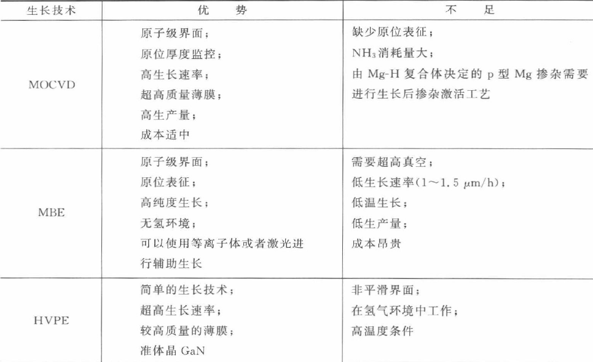

# 半导体物理复习
1. 

https://wenku.baidu.com/view/6b85966688eb172ded630b1c59eef8c75ebf9500.html

1. 密勒指数  
首先求出该晶面在三个主轴上的截距，并以晶格常数的倍数表示截距值，然后对这三个数取倒数，乘上最小公分母简化为三个最小整数。  

2. 密排面  
某一晶体结构中面致密度最大的晶面。面心立方、体心立方、密排六方的密排面分别是(111)、(110)、(0001)。 

3. 
## 第三章 氮化物材料的异质外延生长和缺陷性质

### 3.1 氮化物材料的外延生长技术

1. MOCVD技术：金属有机化合物化学气相淀积。以III族、II族元素的有机化合物和V族、VI族元素的氢化物等作为晶体生长源材料，以热分解反应方式在衬底上进行气相外延，生长各种III-V族、II-VI族化合物半导体以及它们的多元固熔体的薄层单晶材料。优点如下：

   + 适用范围广，几乎可以生长所有化合物及合金半导体薄膜。
   + 非常适用于生长各种异质结构材料。
   + 可以生长超薄外延层，并能获得很陡的界面过渡，易于通过改变气体流量和种类来制备界面陡峭的异质结或多层不同组分的化合物。
   + 生长易于控制
   + 可以生长纯度很高的材料。
   + 外延层大面积均匀性良好。
   + 可以进行大规模生产。

   目前是半导体材料领域中最常用、最有效的方法之一。

2. MBE技术：分子束外延。MBE利用从超高真空系统中来的分子束或原子束沉积在加热的晶体衬底表面进行外延淀积。

   + 生长温度低，生长速率慢，使得外延层厚度可以精确控制，生长表面或界面可以达到原子级光滑。

3. HVPE生长技术：氢化物气相外延生长。

   + 显著特点，生长速率高，是一种生长厚GaN层的很好方法。

