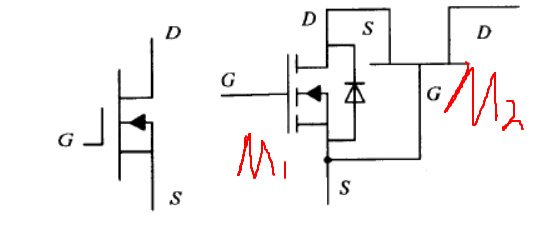
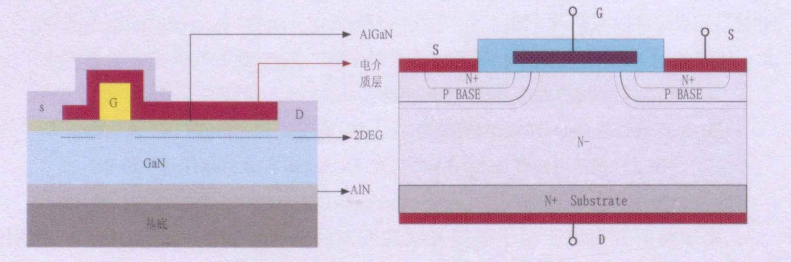

异质结

1. 光伏逆变系统
    光伏逆变器（PV inverter或solar inverter）**可以将光伏（PV）太阳能板产生的可变直流电压转换为市电频率交流电（AC）的逆变器**，可以反馈回商用输电系统，或是供离网的电网使用。光伏逆变器是光伏阵列系统中重要的系统平衡（BOS）之一，可以配合一般交流供电的设备使用。太阳能逆变器有配合光伏阵列的特殊功能，例如最大功率点追踪及孤岛效应保护的机能。

2. 宽禁带半导体氮化镓（GaN）性能
高频、高压、高温和大功率应用的优良半导体材料。

3. 本文研究重点
增强型GaN HEMT、Cascode GaN HEMT在微型光伏逆变系统中的应用优化设计。

4. HEMT
HEMT（High Electron Mobility Transistor），高电子迁移率晶体管。

5. 增强型
场效应管的工作方式有两种：所谓的增强还是耗尽，主要是指MOS管内的反型层。如果在不通电情况下，反型层不存在，电压加到一定程度后，反型层才出现，（当栅压为零，漏极电流也为零，必须再加一定的栅压之后才有漏极电流的）这个就是增强。相反，如果反型层一开始就存在，随着电压强弱，反型层会出现增加或者衰减，（当栅压为零时有较大漏极电流的）这个就是耗尽。

6. 光电效应
在高于某特定频率的电磁波（该频率称为极限频率threshold frequency）照射下，某些物质内部的电子吸收能量后逸出而形成电流，即光生电。

7. 光伏逆变系统的分类
    + 集中式 
        输入采用多个电池板串并联产生高压直流电压。通过一台集中式逆变器将直流电压转为交流电压。
    + 链式
    + 模块式

8. IGBT
IGBT(Insulated Gate Bipolar Transistor)，绝缘栅双极型晶体管，是由BJT(双极型三极管)和MOS(绝缘栅型场效应管)组成的复合全控型电压驱动式功率半导体器件, 兼有MOSFET的高输入阻抗和GTR的低导通压降两方面的优点。

9. MOSFET
MOSFET(Metal Oxide Semiconductor Field Effect Transistor)，Si基金属-氧化物半导体场效应晶体管，可分为三类：垂直扩散型(Vertical Diffusion MOS,VDMOS)、横向扩散型(Lateral Diffusion MOS,LDMOS)和沟道型(Trench MOS,TMOS)

10. 光伏逆变系统的主要指标
    + 逆变系数
        输出电流波形畸变率
    + 输出功率因数
    + 最大功率点跟踪效率~~（MPPT）~~

11. MPPT
MPP(Maximum Power Point),最大功率点；MPPT(Maximum Power Point Traeking)

12. 微型光伏逆变器分类
    + 单级式拓扑结构
    + 准单级式拓扑结构
    + 包括DC/DC变换器产生稳定的中间直流电压，后级采用单相全桥电路将直流电压逆变

13. 提高光伏逆变器的功率和效率
    + 采用先进的电路拓扑和转换技术，如多电平技术和多重化技术
    + 采用软开关技术降低开关管的开关损耗
    + 采用高性能器件

14. 微型光伏逆变器拓扑的特点
    + 功率等级低，适合范围150-300W的场合
    + 输入电压低而输出交流电压高输出电压峰值为311V

15. Cascode（共源共栅）

16. IGBT过流检测技术
    + 检测集电极电流
    + 检测集电极-发射极Uce电压

17. [p15]()通常将耗尽型GaN HEMT与低压增强型Si MOSFET结合成共源共栅（Cascode）增强型复合结构，称为**Cascode GaN HEMT**
共源共栅结构可以看出共源极电路和共栅极电路的串联~~论文这里连打错了~~，即源放大器M1的输出极（漏极）叠加一个开关管M2，其中M2的源极接在M1的漏极，而M2的栅极接在M1漏极。

低压增强型GaNHEMT和高压CascodeGaNHEMT

18. [p16]()GaN HEMT器件不存在N沟道增强型Si MOSFET栅极与源极之间的P型寄生双极区域。

增强型GaN器件结构（图有问题吧两个s极？）

19. 二维电子气
    二维电子气（Two Dimensional Electron Gas,2DEG）指在三维固体材料中只能在二维平面方向上自由移动，而在第三个维度方向上受到限制的自由电子。二维电子气是GaN HEMT中GaN/AlGaN异质结物理特性形成的产物。

20. 异质结
    由两种性质（带隙宽度）不同的半导体材料，通过一定的生长方法所形成的结。
    + 同型异质结（P-p结或N-n结）
    + 异型异质结（P-n结或N-p结）

21. [p17]()增强型GaN HEMT工作原理
    主要通过栅槽刻蚀（Recessed Gate）、p型盖帽层（P-caplayer）、能带工程（Energy Band Engineering）和氟离子注入（Fluorine Ion Implantation）等技术对栅极进行处理，将栅极下的2DEG耗尽，导电沟道夹断实现。

增强型GaN HEMT工作原理

22. 器件性能
    通常栅极-漏极（$Q_{gd}$）和通态电阻（$R_{ds\_on}$）的乘积